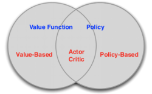
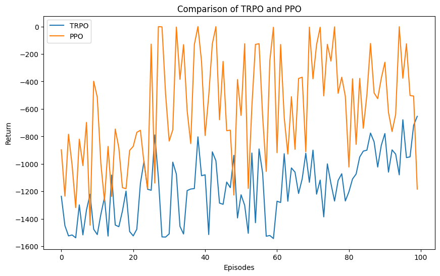

# <div align="center">强化学习中的策略梯度算法
#### <div align="right"> 学号：SA23011253 姓名：任永文 

## 一、引言

强化学习作为一种通过与环境的交互来学习最优策略的机器学习方法，在解决复杂任务和面对不确定性方面展现了强大的潜力。策略梯度方法作为强化学习的一种主要范式，通过直接对策略进行参数化，从而能够有效处理高维、连续动作空间的问题。然而，传统的策略梯度算法在应用中往往面临训练不稳定、样本效率低等挑战，迫使研究者不断寻求改进的途径。

本论文旨在追溯强化学习策略梯度算法改进的历程，聚焦于经典的PPO算法进行了介绍，作为策略梯度领域的一个重要里程碑，它通过引入剪切项，显著提升了算法的稳定性和收敛性。此外，实验对比了PPO算法和TRPO算法的异同和改进，旨在揭示强化学习策略梯度改进的动态发展过程，为未来的研究提供有益的启示。

## 二、策略梯度概述

强化学习是一种通过智能体与环境的交互学习来制定决策的机器学习范式。在强化学习中，智能体通过观察环境的状态，执行动作，接收奖励来学习最优的行为策略。一个典型的强化学习问题可以形式化为马尔可夫决策过程由五元组(S, A, P, R, γ)组成，而强化学习的目标是找到一个最优策略π，使得在给定策略下智能体的累积奖励最大。策略可以是确定性的，也可以是随机性的。

<div align="center"></div>

如上图所示，强化学习可以分为以值函数为中心和以策略为中心两种方法，其中值函数的方法是计算每一个状态动作的值，然后选择值最大的策略作为最终策略，但是这种方法比较间接，并不能找到最优的策略，因此，另一种直接的想法便是采用直接的直接对智能体的策略进行参数化，得到的策略函数表示为：$\pi_\theta = P[a|s,\theta]$，即策略函数确定了在给定状态和一定参数的设置下采取任何可能行为的概率。然后就是通过调整这些参数找到最优策略，具体的机制是设置一个目标函数，对其使用梯度上升算法优化参数以最大化奖励，例如这个目标函数可以选择为累积回报的期望$E[\sum_{t=0}^HR(s_t)|\pi_\theta]$。

策略梯度算法有很多的优势，首先解决了基于值函数的方法存在的策略退化问题；其次，策略梯度能够学到一些随机策略；此外，基于策略梯度的学习更容易收敛；最后，策略梯度能直接适用高维或者连续行为动作空间的强化学习情景。

尽管策略梯度算法在强化学习中取得了显著的进展，但在实际应用中仍然面临一些挑战和问题。首先，由于采样引起的高方差和参数更新的不确定性，算法在一次训练中可能表现出较大的性能波动；其次，由于强化学习通常涉及大量的交互式采样，算法需要花费大量的时间与环境交互以收集足够的经验数据；此外，在面对复杂环境时，策略梯度算法需要在探索和利用之间找到平衡。如果过于强调探索，可能导致收敛缓慢；而过于强调利用则可能使得算法陷入局部最优，难以跳出。

## 三、策略梯度的发展

随着强化学习的发展，早期的策略梯度算法为探索和优化智能体的决策策略奠定了基础。其中，最早的REINFORCE算法通过直接对策略进行梯度上升来更新参数，但由于高方差和训练不稳定性的问题，限制了其在实际问题中的应用。

随后，为解决这些问题，研究者提出了一系列改进算法。其中，Actor-Critic算法引入了一个值函数作为基准，通过减少方差来增强算法的稳定性。然而，这些算法仍然面临着在非常大的策略空间中训练的挑战。

在这一背景下，PPO算法成为策略梯度方法的一个重要进展。提出于OpenAI的研究中，PPO引入了一种新的目标函数，通过在更新中引入剪切项，限制了策略变化的幅度。这种限制使得算法在训练过程中更加稳定，避免了剧烈的策略变化，提高了算法的收敛性。

## 四、TRPO（Trust Region Policy Optimization）算法

在参数更新过程中，传统算法的更新步长 $\alpha$ 是个固定值，很容易从一个不好的策略转到另一个更差的策略上。为了解决训练不稳定，在线更新问题，John Schulman 等人在 TRPO 中提出了用置信区间和自然梯度下降的方法，并顺势而为，用重要性采样将在线改为离线。核心思想就是限制策略更新前后的差异。因为策略是概率函数，于是可用 KL 散度来限制。

让 $\pi_{\theta}$ 表示具有参数 $\theta$ 的策略。理论上，TRPO 的更新规则如下：

$$
\theta_{k+1} = \arg \max_{\theta} \; {\mathcal L}(\theta_k, \theta),
\text{s.t.} \; \bar{D}_{KL}(\theta || \theta_k) \leq \delta
$$

其中，${\mathcal L}(\theta_k, \theta)$ 是替代优势，用于衡量策略$\pi_{\theta}$ 相对于旧策略 $\pi_{\theta_k}$ 在来自旧策略数据的情况下的性能，而 $\bar{D}_{KL}(\theta || \theta_k)$ 是在旧策略访问的状态中，策略之间的平均 KL 散度：

$$
{\mathcal L}(\theta_k, \theta) = \mathbb{E}_{s,a \sim \pi_{\theta_k}} \left[ \frac{\pi_{\theta}(a|s)}{\pi_{\theta_k}(a|s)} A^{\pi_{\theta_k}}(s,a) \right]
$$

$$
\bar{D}_{KL}(\theta || \theta_k) = \mathbb{E}_{s \sim \pi_{\theta_k}} \left[ D_{KL} \left( \pi_{\theta}(\cdot|s) || \pi_{\theta_k} (\cdot|s) \right) \right]
$$

理论上，TRPO 的更新规则并不容易处理，因此为了快速得到答案，TRPO 进行了一些近似。我们对目标和约束在 $\theta_k$ 处展开到一阶项：

$$
{\mathcal L}(\theta_k, \theta) \approx g^T (\theta - \theta_k)
$$

$$
\bar{D}_{KL}(\theta || \theta_k) \approx \frac{1}{2} (\theta - \theta_k)^T H (\theta - \theta_k)
$$

这样原问题转化为一个一个近似的优化问题，

$$
\theta_{k+1} = \arg \max_{\theta} \; g^T (\theta - \theta_k),
\text{s.t.} \; \frac{1}{2} (\theta - \theta_k)^T H (\theta - \theta_k) \leq \delta.
$$

这个近似问题可以通过拉格朗日对偶性的方法进行解析求解，得到以下解：

$$
\theta_{k+1} = \theta_k + \sqrt{\frac{2 \delta}{g^T H^{-1} g}} H^{-1} g.
$$

如果我们停在这一步，仅使用这个最终结果，该算法将完全计算自然策略梯度。问题在于，由于泰勒展开引入的近似误差，这可能不满足KL约束，或者实际上不改善替代优势。TRPO对这个更新规则添加了一个修改：回溯线搜索，

$$
\theta_{k+1} = \theta_k + \alpha^j \sqrt{\frac{2 \delta}{g^T H^{-1} g}} H^{-1} g,
$$

其中 $\alpha \in (0,1)$ 是回溯系数，$j$ 是使得 $\pi_{\theta_{k+1}}$ 满足KL约束并产生正的替代优势的最小非负整数。

最后，计算和存储矩阵的逆 $H^{-1}$ 在处理具有数千或数百万参数的神经网络策略时非常昂贵。TRPO通过使用共轭梯度算法解决 $Hx = g$ 来规避这个问题，其中 $x = H^{-1} g$，只需要一个能够计算矩阵-向量乘积 $Hx$ 的函数，而不是直接计算和存储整个矩阵 $H$。这并不难做到：我们设置一个符号操作来计算

$$
Hx = \nabla_{\theta} \left( \left(\nabla_{\theta} \bar{D}_{KL}(\theta || \theta_k)\right)^T x \right),
$$

这样我们可以在不计算整个矩阵的情况下得到正确的输出。算法的伪代码如下：


## 五、PPO（Proximal Policy Optimization）算法

近端策略优化（PPO）是一种用于强化学习的策略梯度（policy gradient）方法，动机与TRPO相同：如何利用目前掌握的数据，在不意外导致性能崩溃的情况下，对policy采取最大可能的改进措施？

TRPO试图用复杂的二阶方法来解决这个问题，而PPO是一个一阶方法，它使用一些其他技巧来保持新策略接近旧策略。PPO方法实现起来要简单得多，而且从经验上看，它的性能至少与TRPO一样好。PPO算法有两个主要变体的PPO：PPO-Penalty和PPO-Clip。

* PPO-Penalty 近似地解决了像TRPO一样的KL约束更新，但惩罚了目标函数中的KL发散，而不是使其成为硬约束，并在训练过程中自动调整惩罚系数，使其适当缩放。
* PPO-Clip在目标函数中没有KL散度项，也没有任何约束。相反，它依靠对目标函数的专门裁剪来消除新策略远离旧策略的动机，代替KL散度。

实验采用的是PPO-Clip算法，因此下面详细介绍PPO-Clip算法，已知PPO-Clip通过以下方式更新策略：

$$
\theta_{k+1} = \arg \max_{\theta} \underset{s,a \sim \pi_{\theta_k}}{{\mathrm E}}\left[L(s,a,\theta_k, \theta)\right],
$$

通常采用多步（通常是小批量）SGD来最大化这个目标。其中，$L$由以下公式给出：其中 $\epsilon$ 是一个小的超参数，大致表示新策略允许离旧策略有多远。这是简化的版本，稍微容易理解一些（也是我们在代码中实现的版本）：

$$
L(s,a,\theta_k,\theta) = \min\left(
\frac{\pi_{\theta}(a|s)}{\pi_{\theta_k}(a|s)}  A^{\pi_{\theta_k}}(s,a), \;\;
g(\epsilon, A^{\pi_{\theta_k}}(s,a))
\right)
$$

$$
g(\epsilon, A) = \left\{
    \begin{array}{ll}
    (1 + \epsilon) A & A \geq 0 \\
    (1 - \epsilon) A & A < 0.
    \end{array}
    \right.
$$

为了弄清楚这背后的原理，让我们看一个单一的状态-动作对（s，a），并思考几种情况：

* 优势是正数：假设该状态-动作对的优势是正数，那么它对目标的贡献将减少到$\min\left(\frac{\pi_{\theta}(a|s)}{\pi_{\theta_k}(a|s)}, (1 + \epsilon)\right)  A^{\pi_{\theta_k}}(s,a)$，因为优势是正数，如果动作变得更可能，即 $\pi_{\theta}(a|s)$ 增加，目标将增加。但是这个项中的最小值限制了目标可以增加的程度。一旦 $\pi_{\theta}(a|s) > (1+\epsilon) \pi_{\theta_k}(a|s)$，最小值就发挥作用，这个项达到了 $ (1+\epsilon) A^{\pi_{\theta_k}}(s,a)$ 的上限。因此：新策略不会因为远离旧策略而受益。
* 优势是负数：假设该状态-动作对的优势是负数，那么它对目标的贡献将减少到$\max\left(\frac{\pi_{\theta}(a|s)}{\pi_{\theta_k}(a|s)}, (1 - \epsilon)\right)  A^{\pi_{\theta_k}}(s,a)$，因为优势是负数，如果动作变得不太可能，即 $\pi_{\theta}(a|s)$ 减小，目标将增加。但是这个项中的最大值限制了目标可以增加的程度。一旦 $\pi_{\theta}(a|s) < (1-\epsilon) \pi_{\theta_k}(a|s)$，最大值就发挥作用，这个项达到了 $ (1-\epsilon) A^{\pi_{\theta_k}}(s,a)$ 的上限。因此，再次：新策略不会因为远离旧策略而受益。

到目前为止，我们已经看到剪切通过消除策略发生剧变的激励作为一种正则化器，而超参数 $\epsilon$ 对应于新策略在有利于目标的前提下可以离旧策略有多远。算法的伪代码如下：


## 六、PPO算法的代码实现

下面将逐步解释 PPO 的核心部分，并将代码与相应的数学公式进行对应说明。

### 1. 策略网络

首先，定义策略网络。在代码中，这通过构建一个神经网络来表示，其中包含一个输出层，输出代表每个动作的概率分布。

```python
def build_policy_network(self, name, trainable):
    with tf.variable_scope(name):
        layer1 = tf.layers.dense(self.state_ph, 100, tf.nn.relu, trainable=trainable)
        mu = 2 * tf.layers.dense(layer1, action_shape, tf.nn.tanh, trainable=trainable)
        sigma = tf.layers.dense(layer1, action_shape, tf.nn.softplus, trainable=trainable)
        norm_dist = tf.distributions.Normal(loc=mu, scale=sigma)
    params = tf.get_collection(tf.GraphKeys.GLOBAL_VARIABLES, scope=name)
    return norm_dist, params

pi, pi_params = self.build_policy_network('pi', trainable=True)
oldpi, oldpi_params = self.build_policy_network('oldpi', trainable=False)

```

这对应于数学公式中的策略函数 $\pi_{\theta}(a|s)$，表示在状态 $s$ 下执行动作 $ a$的概率，其中 $\theta$是策略网络的参数。
当然，让我们继续介绍 PPO 代码的其他部分。

### 2. 值网络

PPO 算法中使用了值网络来估计状态的值，从而计算优势函数。以下是对值网络的代码部分：

```python
with tf.variable_scope('value'):
    layer1 = tf.layers.dense(self.state_ph, 100, tf.nn.relu)
    self.v = tf.layers.dense(layer1, 1)
    self.Q = tf.placeholder(tf.float32, [None, 1], 'discounted_r')
    self.advantage = self.Q - self.v
    self.value_loss = tf.reduce_mean(tf.square(self.advantage))
    self.train_value_nw = tf.train.AdamOptimizer(0.002).minimize(self.value_loss)
```

这部分代码对应于值网络的构建，值网络通过神经网络估计状态的值，然后计算优势函数$A_t$，并通过最小化值网络的损失来进行训练。

### 3. 代理目标函数

PPO 使用修剪的代理目标函数，其核心是 KL 散度和优势函数。下面是代码中对应的部分：

```python
with tf.variable_scope('loss'):
    with tf.variable_scope('surrogate'):
        ratio = pi.prob(self.action_ph) / oldpi.prob(self.action_ph)
        objective = ratio * self.advantage_ph
        L = tf.reduce_mean(tf.minimum(objective, tf.clip_by_value(ratio, 1.-epsilon, 1.+ epsilon)*self.advantage_ph))
    self.policy_loss = -L
```

这对应于代理目标函数：$L(\theta) = \mathbb{E}_t \left[ \min \left( r_t(\theta) \cdot A_t, \text{clip}(r_t(\theta), 1 - \epsilon, 1 + \epsilon) \cdot A_t \right) \right]$，其中$ r_t(\theta) = \frac{\pi_{\theta}(a_t|s_t)}{\pi_{\text{old}}(a_t|s_t)} $是策略比率，$A_t$是优势函数。这两个函数对应于在给定状态下选择动作和获取状态值的操作。

上述代码中，ratio 表示新策略和旧策略在给定状态下选择相同动作的概率比值，objective 表示修剪前的代理目标，通过 tf.minimum 函数进行修剪，确保在指定范围内。最终，self.policy_loss 表示策略网络的损失，通过负号表示最大化代理目标。

对于TRPO算法，这部分的代码则是
```python
with tf.variable_scope('loss2'):
    with tf.variable_scope('surrogate2'):
        ratio = pi.prob(self.action_ph) / oldpi.prob(self.action_ph)
        objective = ratio * self.advantage_ph

        # TRPO-specific constraint
        kl_divergence = tf.distributions.kl_divergence(oldpi, pi)
        trpo_loss = -tf.reduce_mean(objective - 0.01 * kl_divergence)

    self.policy_loss = trpo_loss
```
### 4. 优化策略网络

最后，通过使用梯度下降法来优化策略网络，使得代理目标函数最小化。

```python
with tf.variable_scope('train_policy'):
    self.train_policy_nw = tf.train.AdamOptimizer(0.001).minimize(self.policy_loss)
```

这对应于梯度下降的步骤，即最小化代理目标函数。

### 5. 采样动作

在 PPO 中，从策略中采样动作是一个重要的步骤，代码中使用 `pi.sample(1)` 来实现。

```python
self.sample_op = tf.squeeze(pi.sample(1), axis=0)
```

这对应于数学公式中的从概率分布中采样动作 $a_t $ 的步骤。

### 6. 旧策略参数更新

在 PPO 中，由于引入了旧策略，需要定期更新旧策略的参数，以保持其与当前策略的同步。以下代码实现了旧策略参数的更新：

```python
with tf.variable_scope('update_oldpi'):
    self.update_oldpi_op = [oldp.assign(p) for p, oldp in zip(pi_params, oldpi_params)]
```

这确保了在策略更新之前，旧策略参数与当前策略参数相匹配。

### 7. 训练函数

PPO 的训练函数包括策略网络和值网络的训练。以下是训练函数的代码：

```python
def train(self, state, action, reward):
    self.sess.run(self.update_oldpi_op)
    adv = self.sess.run(self.advantage, {self.state_ph: state, self.Q: reward})
    [self.sess.run(self.train_policy_nw, {self.state_ph: state, self.action_ph: action, self.advantage_ph: adv}) for _ in range(10)]
    [self.sess.run(self.train_value_nw, {self.state_ph: state, self.Q: reward}) for _ in range(10)]
```

### 8. 选择动作和获取状态值

最后，PPO 提供了选择动作和获取状态值的函数，以用于在实际应用中执行策略。以下是这两个函数的代码：

```python
def select_action(self, state):
    state = state[np.newaxis, :]
    action = self.sess.run(self.sample_op, {self.state_ph: state})[0]
    action = np.clip(action, action_bound[0], action_bound[1])
    return action

def get_state_value(self, state):
    if state.ndim < 2:
        state = state[np.newaxis, :]
    return self.sess.run(self.v, {self.state_ph: state})[0, 0]
```

这部分代码对应于 PPO 的训练函数，其中通过多次执行梯度步骤来训练策略网络和值网络，以最小化代理目标函数和值网络的损失。

## 实验与结论

实验分别用Pytorch实现了两种算法，并且在gym的Pendulum-v1环境下统计了各自的收益曲线，结果如下：

从图上可以看出，在整个训练过程中PPO算法比TRPO算法更快得到收敛，并且总体的收益更高，在每一轮的表现都要优于前者。最后得到两种算法的对比如下：

1. **计算效率：** 通过记录代码运行时间发现，TRPO的计算时间较长，且相较PPO算法实现更复杂
2. **稳定性和收敛性：**  两种算法的稳定性相差不多，但 PPO 算法表现出很好的收敛性
3. **样本利用率：** PPO 的 clipped surrogate objective 允许更大的步长，这可能在使用有限样本时更为有效。在样本稀缺的情况下，PPO 可能具有更好的性能

归其原因，主要是TRPO算法在目标函数之外使用KL散度约束，以约束策略更新，然而，这种方法实现起来更为复杂，计算时间也更长，而PPO算法在其修剪的代理目标函数中直接剪切概率比率，可以通过在目标函数中进行修剪来控制策略更新。而且速度更快，更容易收敛。

但这两种算法都使用在线方式训练随机策略。这意味着它通过按照最新版本的随机策略对动作进行采样来进行探索。动作选择中的随机性取决于初始条件和训练过程。随着训练的进行，策略通常会逐渐变得不太随机，因为更新规则鼓励其利用已经发现的奖励，可能导致策略陷入局部最优解。
