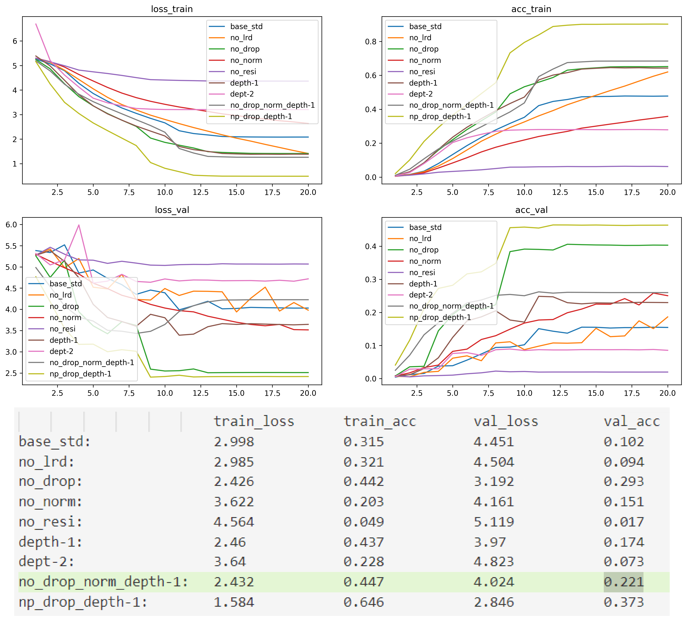

# <div align='center'>实验二</div>

### <div align='right'>SA23011253 任永文</div>

## 实验要求

使用 pytorch 或者 tensorflow 实现卷积神经网络，在 ImageNet 数据集上进行图片分类。研究 dropout, normalization, learning rate decay, residual connection, network depth等超参数对分类性能的影响

## 实验步骤

1. **网络框架**：要求选择 pytorch 或 tensorflow 其中之一，依据官方网站的指引安装包。（如果前面实验已经安装过，则这个可以跳过）
2. **数据集**：这次实验使用 Tiny-Imagenet-200 数据集，包含 200 个类，每个类有 500 张训练图像，50 张验证图像和 50 张测试图像。由于测试图像没有标签，因此使用数据集中的验证集当作测试集，并从训练集中手动划分新的训练集和测试集。下载链接：http://cs231n.stanford.edu/tiny-imagenet-200.zip 或https://rec.ustc.edu.cn/share/4bfe7ba0-cfab-11ed-9877-5f868bfa864a
3. **模型搭建**：采用 pytorch 或 tensorflow 所封装的 module 编写模型，例如 torch.nn.Linear(), torch.nn.Relu() 等，无需手动完成底层 forward、backward 过程。
4. **模型训练**：将生成的训练集输入搭建好的模型进行前向的 loss 计算和反向的梯度传播，从而训练模型，同时也建议使用网络框架封装的 optimizer 完成参数更新过程。训练过程中记录模型在训练集和验证集上的损失，并绘图可视化。
5. **调参分析**：将训练好的模型在验证集上进行测试，以 **Top 1 Accuracy(ACC)** 作为网络性能指标。然后，对 dropout, normalization, learning rate decay, residual connection, network depth 进行调整，再重新训练、测试，并分析对模型性能的影响。
6. **测试性能**：选择你认为最合适的（例如，在验证集上表现最好的）一组超参数，重新训练模型，并在测试集上测试（注意，这理应是你的实验中**唯一**一次在测试集上的测试），并记录测试的结果（ACC）。

## 实验提交

本次实验截止日期为 **`<mark>`11 月 29 日 23:59:59 `</mark>`**，需提交代码源文件及实验报告到邮箱：ustcdl2023@163.com ，具体要求如下：

1. 全部文件打包在一个压缩包内，压缩包命名为 学号-姓名-exp2.zip
2. 实验报告要求 pdf 格式，要求包含姓名、学号。内容包括简要的**实验过程**和**关键代码**展示，对超参数的**实验分析**，最优超参数下的训练集、验证集**损失曲线**以及测

## 实验设计

实验采用控制变量法，基础参数为drop,norm,lrd，res，channels=6层

- dropoutt设计实验对比drop和no_drop
- normalizationi设计实验对比norm和no_norm
- learning rate decay,设计实验对比lrd和no_lrd
- residual connection：设计实验对比res和no_res
- network depth:设计实验对比6，5，4三种层数

## 实验代码

### 1. 模型搭建

1. 自定义卷积网络，
2. 整合不同的变量，可以根据参数个性化定制需要的网络，方便后续实验的设计

```python
class Net(nn.Module):
    """自定义卷积网络
    """

    def __init__(self, channels = [64, 128, 256, 512, 256, 128], dropout=True, normalize=True, residual=True):
        super(Net, self).__init__()

        # 构建网络结构
        self.layers = nn.Sequential()
        channels = [3] + channels  
        if residual:
            for i in range(len(channels) - 1):
                setattr(self.layers, f'conv{i + 1}', conv_norm_relu_drop(channels[i], channels[i + 1], dropout, normalize))
                setattr(self.layers, f'resi{i + 1}', residual_block(channels[i + 1], dropout, normalize))
                setattr(self.layers, f'pool{i + 1}', nn.MaxPool2d(2, 2))
        else:
            for i in range(len(channels) - 1):
                setattr(self.layers, f'conv{i + 1}_1', conv_norm_relu_drop(channels[i], channels[i + 1], dropout, normalize))
                setattr(self.layers, f'conv{i + 1}_2', conv_norm_relu_drop(channels[i + 1], channels[i + 1], dropout, normalize))
                setattr(self.layers, f'conv{i + 1}_3', conv_norm_relu_drop(channels[i + 1], channels[i + 1], dropout, normalize))
                setattr(self.layers, f'pool{i + 1}', nn.MaxPool2d(2, 2))

        # 添加全连接层
        self.fc1 = nn.Linear(channels[-1] * 2**(12-2*len(channels)+2), 200)


    def forward(self, x):
        x = self.layers(x)
        x = x.reshape(x.shape[0], -1)
        x = self.fc1(x)
        return x
```

### 2. 实验设置

1. 将所有的对照变量接口暴露出来方便调试
2. 设置实验过程中的一些训练参数
3. 设置6组对照实验分别对不同的对象进行调参设计

```python
def Test(lrd=True,dropout=True,normalize=True,residual=True,channels= [64, 128, 256, 512, 256, 128]):

    device = torch.device("cuda") if torch.cuda.is_available() else torch.device("cpu")
    net = Net(channels, dropout, normalize, residual).to(device)
    lr = 0.001
    optimizer = optim.Adam(net.parameters(), lr=lr)
    loss_func = nn.CrossEntropyLoss()
    scheduler = ReduceLROnPlateau(optimizer, 'min', patience=1, verbose=True)
    wait = 4
    epochs = 3

    data, curves = Training(device, net, trainloader, valloader, lr, lrd, optimizer,loss_func,scheduler,wait,epochs)
    return data,curves


p11 = Test(lrd=True,dropout=True,normalize=True,residual=True,channels= [64, 128, 256, 512, 256, 128])
p12 = Test(lrd=False,dropout=True,normalize=True,residual=True,channels= [64, 128, 256, 512, 256, 128])
p13 = Test(lrd=True,dropout=False,normalize=True,residual=True,channels= [64, 128, 256, 512, 256, 128])
p14 = Test(lrd=True,dropout=True,normalize=False,residual=True,channels= [64, 128, 256, 512, 256, 128])
p15 = Test(lrd=True,dropout=True,normalize=True,residual=False,channels= [64, 128, 256, 512, 256, 128])
p16 = Test(lrd=True,dropout=True,normalize=True,residual=True,channels= [64, 128, 256, 512, 256])
p17 = Test(lrd=True,dropout=True,normalize=True,residual=True,channels= [64, 128, 256, 512])
```

### 3. 结果展示

1. 将不同组对比试验实验结果放在同一张图片中方便分析
2. 保存不同组对比实验的平均实验结果

```python
def plotter(title,p):
    fig, axs = plt.subplots(2, 2, figsize=(16, 9), dpi=300)
    x = range(len(p[0][1][0]))
    axs[0,0].set_title('loss_train')
    axs[0,1].set_title('loss_val')
    axs[1,0].set_title('acc_train')
    axs[1,1].set_title('acc_val')
    legend = []
    for i in range(len(title)):
        legend.extend([title[i]])
        axs[0,0].plot(x, p[i][1][0])
        axs[0,1].plot(x, p[i][1][1])
        axs[1,0].plot(x, p[i][1][2])
        axs[1,1].plot(x, p[i][1][3])
    axs[0,0].legend(legend)
    axs[0,1].legend(legend)
    axs[1,0].legend(legend)
    axs[1,1].legend(legend)
    plt.savefig(out_path+f"out.png")
    plt.show()

    with open(out_path+f"out.txt", "w") as file:
        for i in range(len(title)):
            file.write(title[i]+":"+'\t'.join(map(str, p[i][0]))+"\n")
  
plotter(['std','no_lrd','no_drop','no_norm','no_res','depth-1','dept-2'],[p11,p12,p13,p14,p15,p16,p17])
```

## 实验结论

由于实验平台GPU算力有限，最终在1650Ti上每组实验运行了20轮观察结果，可以看出模型还未达到收敛，但可以观察到不同因素的影响

- dropout：该操作在模型复杂时可以作为正则化手段防止过拟合，但本实验中可能由于模型简单，因此drop的效果不好
- normalization：本实验中使用norm在训练集上效果较好效果，但在验证集上稍微较差
- learning rate decay：lrd自适应调整学习率，本实验中使用lrd在训练集上效果不好，但在验证集上有明显优势
- residual connection：残差结构对性能提升明显，能加速网络收敛
- network depth：由两组对比试验结果可知，网络层数太深或太浅对结果都不太好，网络结构太复杂导致收敛慢且容易过拟合，网络结构太简单导致最终准确度低

最终选定的最优参数结果为：no_drop，norm，lrd，res，channels=5层，在测试集上的准确率为0.4613




