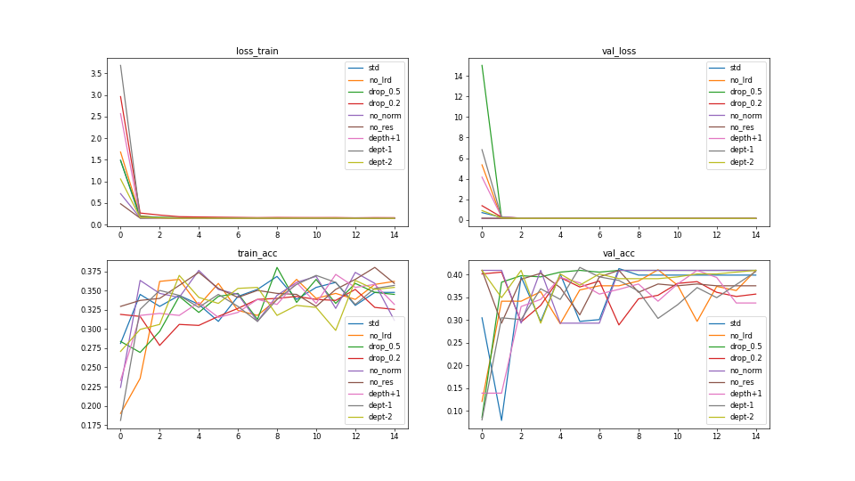

# <div align='center'>实验三</div>

### <div align='right'>SA23011253 任永文</div>

## 实验要求

编写RNN的语言模型，并基于训练好的词向量，编写RNN模型用于文本分类·请助教准备相关数据集 (参考文献如下)

Yang, Zichao, Diyi Yang, Chris Dyer, Xiaodong He, Alex Smola, and Eduard Hovy. "Hierarchical attention networks for document classification." In *Proceedings of the 2016 conference of the North American chapter of the association for computational linguistics: human language technologies*, pp. 1480-1489. 2016.

## 实验步骤

1. **网络框架**：要求选择 pytorch 或 tensorflow 其中之一，依据官方网站的指引安装包。（如果前面实验已经安装过，则这个可以跳过）
2. **数据集**：这次实验使用 Yelp2013 数据集。使用数据集中的test.json当作测试集，并从yelp_academic_dataset_review.json中手动划分训练集和验证集。下载链接：https://github.com/rekiksab/Yelp/tree/master/yelp_challenge/yelp_phoenix_academic_dataset 只需要使用stars评分和text评论内容即可。
3. **模型搭建**：采用 pytorch 或 tensorflow 所封装的 module 编写模型，例如 torch.nn.Linear(), torch.nn.Relu() 等，无需手动完成底层 forward、backward 过程。
4. **模型训练**：将生成的训练集输入搭建好的模型进行前向的 loss 计算和反向的梯度传播，从而训练模型，同时也建议使用网络框架封装的 optimizer 完成参数更新过程。训练过程中记录模型在训练集和验证集上的损失，并绘图可视化。
5. **调参分析**：将训练好的模型在验证集上进行测试，以 **Top 1 Accuracy(ACC)** 作为网络性能指标。然后，对 dropout, normalization, learning rate decay, residual connection, network depth 进行调整，再重新训练、测试，并分析对模型性能的影响。
6. **测试性能**：选择你认为最合适的（例如，在验证集上表现最好的）一组超参数，重新训练模型，并在测试集上测试（注意，这理应是你的实验中**唯一**一次在测试集上的测试），并记录测试的结果（ACC）。

## 实验提交

本次实验截止日期为 **<mark>12 月 17 日 23:59:59</mark>**，需提交代码源文件及实验报告到邮箱：ustcdl2023@163.com ，具体要求如下：

1. 本次实验没有示例代码，需要自行完成数据处理，模型搭建整个pipeline
2. 全部文件打包在一个压缩包内，压缩包命名为 学号-姓名-exp3.zip
3. 实验报告要求 pdf 格式，要求包含姓名、学号。内容包括简要的**实验过程**和**关键代码**展示，对超参数的**实验分析**，最优超参数下的训练集、验证集**损失曲线**以及测试集上的**实验结果**。

## 实验设计

本次实验还是采用控制变量法，基础参数为no_drop,norm,lrd,res,network_depth=3层

- dropout设计实验对比drop=0.5，drop=0.2和no_drop
- normalization设计实验对比norm和no_norm
- learning rate decay,设计实验对比lrd和no_lrd
- residual connection：设计实验对比res和no_res，其中res操作是指在网络中每个卷积层后都加一个residual块
- network depth:设计实验对比4，3，2三种层数，这里depth指的是RNN模块的层数

## 实验代码

### 1. 数据处理

1. 收集所有评论构建合适大小的字典，通过stopwords等手段缩减词典的大小，为字典中的每个单词构建索引和300维的向量，将word2index和word2vec都存储下来（0-3的索引预留为pad，start，end和unk，对应都为零向量）
2. 自定义数据集类Data，主要操作是将每条数据的text利用word2vec转化为一个序列长度为200，单词特征为300维的张量（如果单词不够200个则用0向量补齐），将star转化为1*5的onehot张量，最终返回两个数据的张量形式

```python

def word2index():
    corpus = []
    stopwords=set([word.strip() for word in open('stopwords.txt',encoding='utf-8')])
    with open('yelp_academic_dataset_review.json', 'r', encoding='utf-8') as file:
        for line in file:
            corpus.append([word.lower() for word in word_tokenize(json.loads(line)['text']) if word.lower() not in stopwords])
    model=gensim.models.word2vec.Word2Vec(corpus,size=300,min_count=10)
    word2vec = [[0] * 300] * 4 + [model[word] for word in word2index]
    word2index = {word: i + 4 for i, word in enumerate(model.wv.index2word)}
    json.dump(word2index, open('word2index.json', 'w', encoding='utf-8'), ensure_ascii=False)
    np.save('word2vec.npy', word2vec)

class Data(Dataset):
    def __init__(self, texts, stars, args):
        assert len(texts)==len(stars)
        self.pad = args.pad
        self.start = args.start
        self.end = args.end
        self.unk = args.unk
        self.vec_len = args.vec_len
        self.word2index = args.word2index
        self.word2vec = args.word2vec
        self.texts = [word_tokenize(text) for text in texts]
        self.stars = [star for star in stars]
        
    def text2vec(self, text):
        """
        对文本进行填充和词向量化
        """
        vector = np.empty((0, 300))
        for word in text:
            vector = np.concatenate((vector, self.word2vec[self.word2index.get(word,self.unk)].reshape(1,-1)),axis=0)
        if len(vector)>=self.vec_len:
            return vector[-self.vec_len:]
        else:
            return np.concatenate((vector, np.stack([self.word2vec[self.pad] for _ in range(self.vec_len - len(vector))])),axis=0)

    def __getitem__(self, idx):
        text = self.texts[idx]
        star = self.stars[idx]
        return torch.tensor(self.text2vec(text),dtype=torch.float), torch.eye(args.output_size)[star - 1]
    
    def __len__(self):
        return len(self.texts)

```

### 2. 模型搭建

1. 自定义循环神经网络，使用了实验二的residual_block作对比试验
2. 整合不同的变量，可以根据参数个性化定制需要的网络，方便后续实验的设计
3. 网络首先经过卷积和残差网络提取word的特征，再经过循环网络提取序列间信息，最后将得到的output再经过卷积抽取输出特征，经过全连接层映射到输出维度即1*5维

```python
class RNN(nn.Module):
    def __init__(self, args, dropout=0.5, normalization=False, residual=False, num_layers=1):
        super(RNN, self).__init__()
        self.hidden_size = args.hidden_size
        self.input_size = args.input_size
        self.output_size = args.output_size
        self.batch_size = args.batch_size
        self.conv_size = args.conv_size
        self.rnn_layers = nn.ModuleList()
        self.num_layers = num_layers
        self.dropout = dropout
        self.normalization = normalization
        self.residual = residual
        self.conv1 = conv_norm_relu_drop(self.input_size, self.conv_size ,self.dropout, self.normalization).to(args.device)
        self.res1 = residual_block(self.conv_size ,self.dropout, self.normalization).to(args.device)
        self.conv2 = conv_norm_relu_drop(self.conv_size, self.conv_size ,self.dropout, self.normalization).to(args.device)
        self.res2 = residual_block(self.conv_size ,self.dropout, self.normalization).to(args.device)
        self.rnn = nn.RNN(self.conv_size, self.hidden_size, self.num_layers, batch_first=True, dropout=self.dropout).to(args.device)
        self.conv3 = conv_norm_relu_drop(self.hidden_size, self.hidden_size ,self.dropout, self.normalization).to(args.device)
        self.res3 = residual_block(self.hidden_size ,self.dropout, self.normalization).to(args.device)
        self.fc = nn.Linear(self.hidden_size, self.output_size).to(args.device)

    def forward(self, x):
        x = x.permute(0,2,1)
        x = self.conv1(x)
        if self.residual:
            x = self.res1(x)
        x = self.conv2(x)
        if self.residual:
            x = self.res2(x)
        hidden = torch.rand(self.num_layers, x.size(0), self.hidden_size).to(args.device)
        x = x.permute(0,2,1)
        output, hidden = self.rnn(x, hidden)
        output = output.permute(0,2,1)
        output = self.conv3(output)
        if self.residual:
            output = self.res3(output)
        output = output.permute(0,2,1)
        output = self.fc(output[:, -1, :])
        return output
```

### 3. 模型训练

1. 设置常规的训练任务
2. 由于数据集较大，训练轮数较少，因此选择每一轮保存5次loss信息，并且每次保存loss信息时进行一次eval操作

```python

def acc(labels, outputs, type_="top1"):
    acc = 0
    if type_ == "top1":
        pre_labels = np.argmax(outputs, axis=1)
        labels = np.argmax(labels, axis=1)
        acc = np.sum(pre_labels == labels) / len(pre_labels)

    return acc

def Training(args, net, trainloader, valloader, lrd, optimizer,loss_func,scheduler):
    print("start training-----------------------")
    epochs = args.epochs
    device = args.device
    train_loss_list = []
    val_loss_list = []
    train_acc_list = []
    val_acc_list = []
    for i in range(epochs):
        train_loss = 0.0
        train_acc = 0.0
        val_loss = 0.0
        val_acc = 0.0
        
        for idx, (inputs,labels) in enumerate(trainloader):
            inputs = inputs.to(device)
            labels = labels.to(device)
            optimizer.zero_grad()
            outputs = net(inputs)
            loss = loss_func(outputs, labels)
            train_loss += loss.item()
            train_acc += acc(labels=labels.cpu().numpy(), outputs=outputs.detach().cpu().numpy())
            loss.backward()
            optimizer.step()
            if idx % (len(trainloader)//50) == 0:
                print(idx, (len(trainloader)//50), idx % (len(trainloader)//50))
                train_loss = train_loss / (len(trainloader)/50)
                train_acc = train_acc / (len(trainloader)/50)
                train_loss_list.append(train_loss)
                train_acc_list.append(train_acc)
                net.eval()
                for inputs, labels in valloader:
                    inputs = inputs.to(device)
                    labels = labels.to(device)
                    outputs = net(inputs)
                    loss = loss_func(outputs, labels)
                    val_loss += loss.item()
                    val_acc += acc(labels=labels.cpu().numpy(), outputs=outputs.detach().cpu().numpy())
                val_loss = val_loss / len(valloader)
                val_acc = val_acc / len(valloader)
                val_loss_list.append(val_loss)
                val_acc_list.append(val_acc)
                net.train()
                print(f"Epoch {i}({100*idx/len(trainloader)}%): train_loss {train_loss:10.6f}, train_acc {train_acc:7.4f}, val_loss {val_loss:10.6f}, val_acc {val_acc:7.4f}")

                if lrd:
                    scheduler.step(val_loss)
                train_loss = 0.0
                train_acc = 0.0
                val_loss = 0.0
                val_acc = 0.0
    return [train_loss_list, val_loss_list, train_acc_list, val_acc_list]

```

### 4. 实验设置

1. 设置Args类保存不需要对照的全局参数
2. 前面的准备工作已经将所有的对照变量接口暴露出来方便调试
3. 设置实验过程中的一些训练参数
4. 设置6组对照实验分别对不同的变量进行调参设计

```python

    class Args:
        def __init__(self):
            self.device = torch.device("cuda" if torch.cuda.is_available() else "cpu")
            self.batch_size = 64
            self.num_workers = 0

            self.input_size = 300
            self.hidden_size = 64
            self.output_size = 5
            self.num_layers = 3
            self.epochs = 5

            self.pad = 0
            self.start = 1
            self.end = 2
            self.unk = 3
            self.vec_len = 200
            self.word2index = json.load(open('word2index.json', encoding='utf-8'))
            self.word2vec = np.load('word2vec.npy')
            self.lr = 0.001

    set_ups = [{'lrd':True,'dropout':False,'normalization':True,'residual':True,'network_depth':3},
    {'lrd':False,'dropout':False,'normalization':True,'residual':True, 'network_depth':3},
    {'lrd':True,'dropout':True,'normalization':True,'residual':True, 'network_depth':3},
    {'lrd':True,'dropout':False,'normalization':False,'residual':True, 'network_depth':3},
    {'lrd':True,'dropout':False,'normalization':True,'residual':False,'network_depth':3},
    {'lrd':True,'dropout':False,'normalization':True,'residual':True,'network_depth':4},
    {'lrd':True,'dropout':False,'normalization':True,'residual':True,'network_depth':2}
    ]
    results = []
    for set_up in set_ups:
        rnn = RNN(args,set_up['dropout'],set_up['normalization'],set_up['residual'],set_up['network_depth'])
        optimizer = optim.Adam(rnn.parameters(), lr=args.lr)
        loss_func = nn.MSELoss()
        scheduler = ReduceLROnPlateau(optimizer, 'min', patience=1, verbose=True)
        result = Training(args, net=rnn, trainloader=train_loader, valloader=val_loader, lrd=set_up['lrd'], optimizer=optimizer, loss_func=loss_func, scheduler=scheduler)
        results.append(result)
    plotter(['std','no_lrd','no_drop','no_norm','no_res','depth+1','dept-1'],results)
```

### 5. 结果展示

1. 将不同组对比试验实验结果放在同一张图片中方便分析
2. 保存不同组对比实验的平均实验结果

```python
def plotter(title,p):
    fig, axs = plt.subplots(2, 2, figsize=(16, 9), dpi=60)
    x = range(len(p[0][0]))
    axs[0,0].set_title('loss_train')
    axs[0,1].set_title('val_loss')
    axs[1,0].set_title('train_acc')
    axs[1,1].set_title('val_acc')
    legend = []
    for i in range(len(title)):
        legend.extend([title[i]])
        axs[0,0].plot(x, p[i][0])
        axs[0,1].plot(x, p[i][1])
        axs[1,0].plot(x, p[i][2])
        axs[1,1].plot(x, p[i][3])
    axs[0,0].legend(legend)
    axs[0,1].legend(legend)
    axs[1,0].legend(legend)
    axs[1,1].legend(legend)
    plt.savefig("out.png")
    plt.show()
    with open("out.txt", "w") as file:
        for i in range(len(title)):
            file.write(title[i]+":"+'\t'.join(map(str, p[i,:,-1]))+"\n")
```

## 实验结论

总的来说，模型很快就会收敛，准确率在0.4左右，在增加模型复杂性等操作后仍然无法改善问题，由于数据集较大，算力有限，没有深究背后的原因。由于实验中模型很快收敛且不同对比试验最终达到的准确率相似，最终在1650Ti上每组实验运行了3轮观察结果，观察到不同因素的影响



- dropout：该操作在模型复杂时可以作为正则化手段防止过拟合，本实验中使用dropout的收敛速度更快
- normalization：本实验中使用norm的效果不太好，收敛速度慢
- learning rate decay：lrd自适应调整学习率，本实验中使用lrd收敛速度慢
- residual connection：本实验中使用残差连接效果不好，收敛速度慢
- network depth：本实验中，使用的网络层数越少，收敛速度越快

总的来说，本次实验中模型越简单收敛速度越快，且最终的准确率都在0.4左右，选定的最优参数结果为：drop0.5，no_norm，no_lrd，no_res，depth-2，在测试集上的准确率为0.4086

