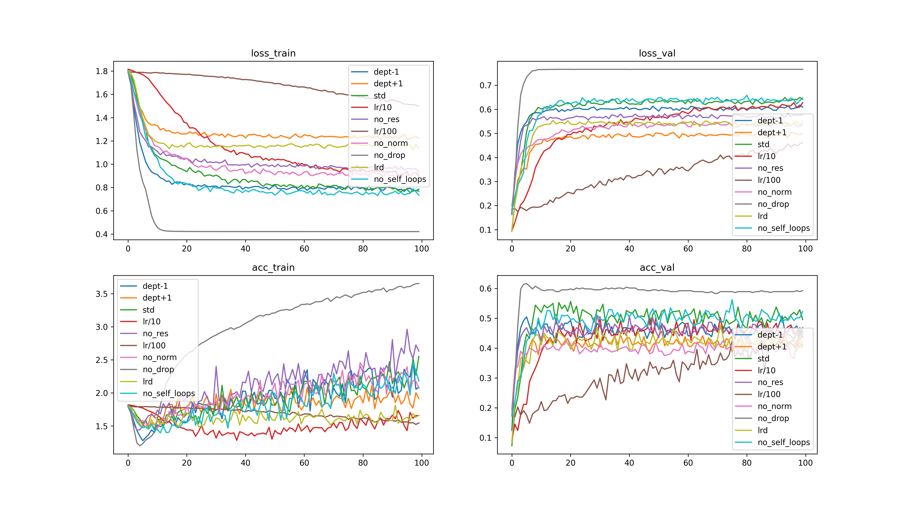
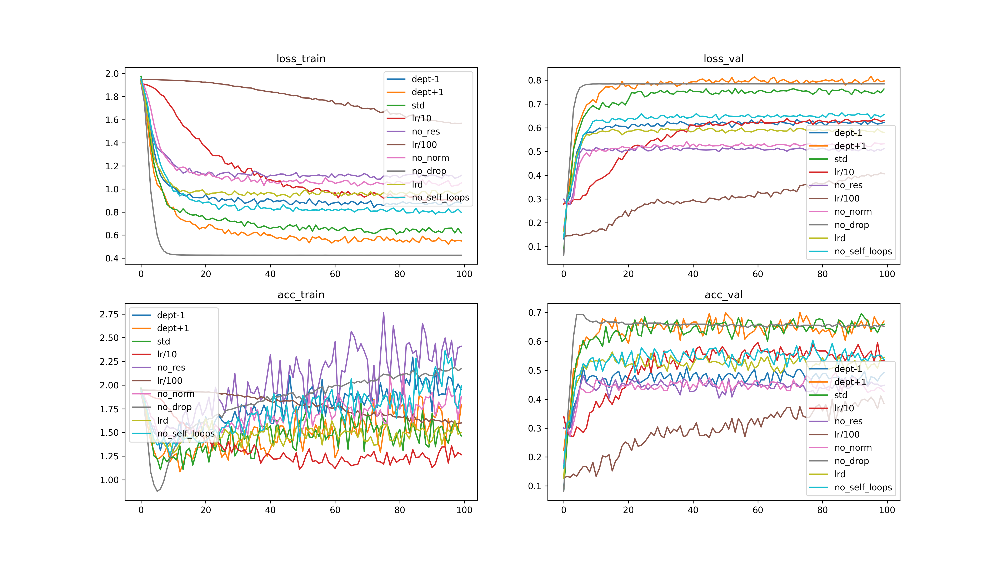
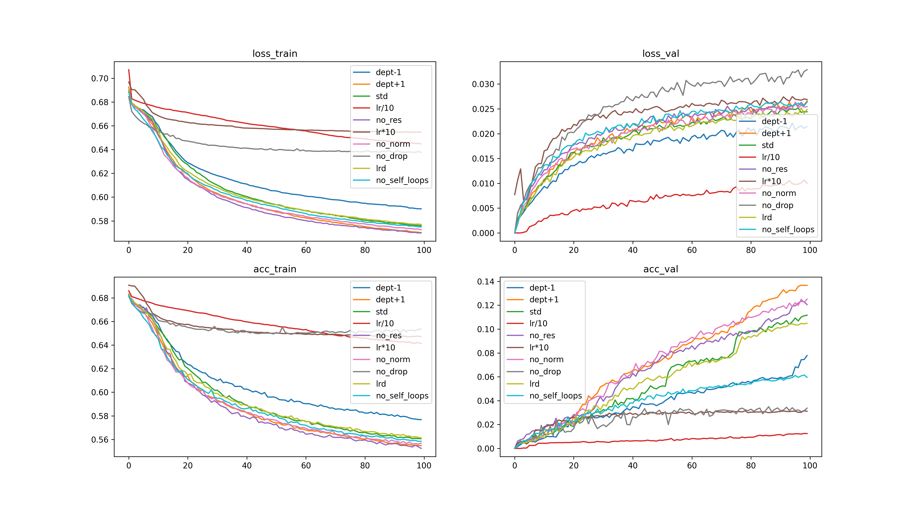

# <div align='center'>实验四</div>

### <div align='right'>SA23011253 任永文</div>

## 实验要求

使用 pytorch 或者 tensorflow 的相关神经网络库，编写图卷积神经网络模型 (GCN)，并在相应的图结构数据集上完成节点分类和链路预测任务，最后分析自环、层数、DropEdge 、PairNorm 、激活函数等因素对模型的分类和预测性能的影响 。

## 实验步骤

1. **网络框架**：要求选择 pytorch 或 tensorflow 其中之一，依据官方网站的指引安装包。（如果前面实验已经安装过，则这个可以跳过）
2. **数据集**：本次实验使用的数据包含三个常用的图结构数据集：Cora 、Citeseer 、PPI。下面分别进行介绍。
   **（1）Cora：**该数据集是由2708篇机器学习论文作为节点、论文间引用关系作为有向边构成的图数据。具体的数据描述见 [https://blog.csdn.net/qq_33254870/article/details/103553661](https://blog.csdn.net/qq_33254870/article/details/103553661) 。数据集下载链接 [https://linqs-data.soe.ucsc.edu/public/lbc/cora.tgz](https://linqs-data.soe.ucsc.edu/public/lbc/cora.tgz) 。另外，提供一个数据处理范例链接 [https://graphsandnetworks.com/the-cora-dataset/](https://graphsandnetworks.com/the-cora-dataset/) 。请同学们仔细阅读相关材料，了解文件的具体结构和数据格式。
   **（2）Citeseer：**该数据集是由3312篇论文及相互引用构成的图数据集。数据集下载链接[https://linqs-data.soe.ucsc.edu/public/lbc/citeseer.tgz](https://linqs-data.soe.ucsc.edu/public/lbc/citeseer.tgz) 。文件的结构和数据格式与Cora类似。
   **（3）PPI：**PPI网络是蛋白质相互作用（ProteinProteinInteraction,PPI）网络的简称数描述可参考链接 [https://blog.csdn.net/ziqingnian/article/details/112979175](https://blog.csdn.net/ziqingnian/article/details/112979175) 。数据集下载链接 [http://snap.stanford.edu/graphsage/ppi.zip](http://snap.stanford.edu/graphsage/ppi.zip) 。
3. **数据预处理**：你需要通过pytorch或tensorflow所提供的标准数据接口，将原始数据处理为方便模型训练脚本所使用的数据结构，如torch.utils.data.Dataset等。由于这三个数据集是非常常见的公开数据集，你可以参考一些公开代码片段，尤其是github上典型的GCN教程级实现或相关论文的源码。
4. **模型搭建**：搭建GCN模型，这一步可以参考网络上公开的源码，但不能直接使用封装过的库。
5. **模型训练**：将生成的训练集输入搭建好的模型进行前向的 loss 计算和反向的梯度传播，从而训练模型，同时也建议使用网络框架封装的 optimizer 完成参数更新过程。训练过程中记录模型在训练集和验证集上的损失，并绘图可视化。
6. **节点分类**：在三个数据集上按照节点分类任务的需求自行划分训练集、验证集、测试集，并用搭建好的GCN模型进行节点分类。
7. **链路预测**：在三个数据集上按照链路预测任务的需求自行划分训练集、验证集、测试集，并用搭建好的GCN模型进行节点分类。
8. **调参分析**：将训练好的模型在验证集上进行测试，以 **Top 1 Accuracy(ACC)** 作为网络性能指标。然后，对自环、层数、DropEdge 、PairNorm 、激活函数进行调整，再重新训练、测试，并分析对模型性能的影响。
9. **测试性能**：选择你认为最合适的（例如，在验证集上表现最好的）一组超参数，重新训练模型，并在测试集上测试（注意，这理应是你的实验中**唯一**一次在测试集上的测试），并记录测试的结果（ACC）。

## 实验提交

本次实验截止日期为 **<mark>1 月 7 日 23:59:59 </mark>**，需提交代码源文件及实验报告到邮箱：ustcdl2023@163.com ，具体要求如下：

1. 本次实验没有示例代码，需要自行完成数据处理，模型搭建整个pipeline
2. 全部文件打包在一个压缩包内，压缩包命名为 学号-姓名-exp4.zip
3. 实验报告要求 pdf 格式，要求包含姓名、学号。内容包括简要的**实验过程**和**关键代码**展示，对超参数的**实验分析**，最优超参数下的训练集、验证集**损失曲线**以及测试集上的**实验结果**。

## 实验设计

本次实验还是采用控制变量法，基础参数为num_layers=3, alpha=0.5, add_self_loops=True, normalize=True, dropout=0.2, lrd=False，对于cora和citeseer任务lr=0.1, 对于ppi任务lr=0.001

- learning rate,设计实验对比0.1和0.01和0.001
- num_layers:设计实验对比4，3，2三种层数，这里depth指的是图卷积模块的层数
- residual connection：设计实验对比alpha=0和alpha=0.5
- self_loops：设计实验对比add_self_loops=True和False
- normalization设计实验对比norm和no_norm
- dropout设计实验对比drop=0.5，drop=0.2和no_drop
- learning rate decay,设计实验对比lrd和no_lrd

## 实验代码

### 1. 数据处理

1. 对于cora和citeseer数据集，直接读取.content文件构造fea_matrix，读取.cites矩阵构建adj_matrix，由于整个数据集只有一张图，不能完整地区分训练集，测试集和验证集，因此利用mask将同一张图中结点按比例分成训练集，测试集和验证集进行实验。
2. 对于ppi数据集，本想按照同样方法读取图，但是一方面ppi数据集中的五张图也难以区分，另一方面将整个数据集构造成一张大图经实验发现由于矩阵太大，矩阵乘法对计算资源消耗极大，因此选择了直接导入torch_geometric.datasets库中的PPI数据集，并在之前进行预处理变成稀疏矩阵。
3. 对于节点分类和链路预测两种数据集划分方式差别不大，分别可通过T.RandomNodeSplit()和T.RandomLinkSplit()用类似mask的方式实现。

```python
def load_data(prefix):
    name_idx, label_idx = {}, {}
    with open(prefix+".content") as file:
        lines = file.readlines()
        fea_matrix = torch.zeros((len(lines), len(lines[0].strip().split())-2),dtype=torch.float)
        label = torch.zeros((len(lines)),dtype=torch.long)
        for line in tqdm(lines, desc='Processing .content', unit='line'):
            data_split = line.strip().split()
            if data_split[0] not in name_idx:
                name_idx[data_split[0]] = len(name_idx)
            if data_split[-1] not in label_idx:
                label_idx[data_split[-1]] = len(label_idx)
            transform_idx = name_idx[data_split[0]]
            label[transform_idx] = label_idx[data_split[-1]]
            for j in range(len(data_split) - 2):
                fea_matrix[transform_idx][j] = int(data_split[j + 1])
        fea_matrix = fea_matrix / fea_matrix.sum(1, keepdims=True)

    # 创建稀疏矩阵
    with open(prefix + ".cites") as file:
        row_indices = []
        col_indices = []
        for line in tqdm(file, desc='Processing .cites', unit='line'):
            data_split = line.strip().split()
            if data_split[0] in name_idx and data_split[1] in name_idx:
                first_node, second_node = name_idx[data_split[0]], name_idx[data_split[1]]
                row_indices.append(first_node)
                col_indices.append(second_node)
    row_indices = torch.tensor(row_indices)
    col_indices = torch.tensor(col_indices)
    values = torch.ones_like(row_indices, dtype=torch.float)  # 使用 1 表示连接
    adj_matrix = SparseTensor(row=row_indices, col=col_indices, value=values, sparse_sizes=(len(name_idx), len(name_idx)))
    return fea_matrix, adj_matrix, label

fea_matrix, adj_matrix, label = load_data("data/citeseer/citeseer")
indices = torch.randperm(fea_matrix.size(0))
train_size = int(0.8 * fea_matrix.size(0))
valid_size = int(0.1 * fea_matrix.size(0))
train_idx, valid_idx, test_idx = torch.split(indices, [train_size, valid_size, fea_matrix.size(0) - train_size - valid_size])
train_mask = torch.zeros(fea_matrix.shape[0], dtype=torch.bool)
valid_mask = torch.zeros(fea_matrix.shape[0], dtype=torch.bool)
test_mask = torch.zeros(fea_matrix.shape[0], dtype=torch.bool)
train_mask[train_idx], valid_mask[valid_idx], test_mask[test_idx]=True, True, True

pre_transform = T.Compose([T.GCNNorm(), T.ToSparseTensor()])
train_dataset = PPI("data/ppi", split='train')
valid_dataset = PPI("data/ppi", split='val', pre_transform=pre_transform)
test_dataset = PPI("data/ppi", split='test', pre_transform=pre_transform)
train_loader = DataLoader(train_dataset, shuffle=True)
valid_loader = DataLoader(valid_dataset, shuffle=False)
test_loader = DataLoader(test_dataset, shuffle=False)
```

### 2. 模型搭建

尝试了两种方案

1. 使用库torch_geometric中的图卷积层GCN2Conv搭建成模型Net
2. 自定义图卷积层GCNConv(in)并搭建成模型Net2

实验发现自定义模型Net2对citeseer和cora数据库的表现都比Net要更好，而且收敛速度很快

```python
class Net(torch.nn.Module):
    def __init__(self, nfeat, nhid, nout, num_layers, alpha, add_self_loops, normalize, dropout):
        super().__init__()
        self.fc1 = nn.Linear(nfeat, nhid)
        self.fc2 = nn.Linear(nhid, nout)
        self.convs = torch.nn.ModuleList()
        for i in range(num_layers):
            self.convs.append(GCN2Conv(nhid, alpha, add_self_loops=add_self_loops, normalize=normalize))
        self.drop = nn.Dropout(dropout)
        self.relu = nn.ReLU()

    def forward(self, x, adj_t):
        x = x_0 = self.drop(self.relu(self.fc1(x)))
        for conv in self.convs:
            x = self.drop(self.relu(conv(x, x_0, adj_t) + x))
        x = self.drop(self.relu(self.fc2(x)))
        return x

class GCNConv(nn.Module):
    def __init__(self, in_channels,out_channels):
        super().__init__()
        self.weight = nn.Parameter(torch.Tensor(in_channels, out_channels))
        nn.init.kaiming_uniform_(self.weight)

    def forward(self, input, adj_matrix):
        if isinstance(adj_matrix,SparseTensor):
            adj_matrix = adj_matrix.to_dense()
        degree_matrix = torch.diag(torch.sum(adj_matrix, 1)).inverse().sqrt()
        adj_hat_matrix = torch.spmm(torch.spmm(degree_matrix, adj_matrix + torch.eye(adj_matrix.size(0))), degree_matrix)
        output = torch.relu(torch.spmm(adj_hat_matrix, torch.spmm(input, self.weight)))
        return output

class Net2(nn.Module):
    def __init__(self, nfeat, nhid, nout):
        super().__init__()
        self.conv1 = GCNConv(nfeat, nhid)
        self.conv2 = GCNConv(nhid, nout)

    def forward(self, x, adj_t):
        x = self.conv1(x, adj_t)
        x = self.conv2(x, adj_t)
        return x
```

### 3. 模型训练

1. 设置常规的训练任务，这里略去，详见代码
2. 由于数据集较小，训练轮数较多，因此选择每10轮保存1次loss信息并进行一次eval操作
3. 对于多标签分类任务和单标签分类任务，使用的损失函数不同

```python
# 多标签
loss_fn = torch.nn.BCEWithLogitsLoss().to(device)
acc = ((torch.sigmoid(out) > 0.5).long() == data.y).all(dim=1).float().mean().item()
# 单标签
loss_fn = torch.nn.CrossEntropyLoss().to(device)
train_acc = torch.eq(train_predict.max(1).indices, train_label).float().mean(0)
```

### 4. 实验设置

1. 设置10组对照实验分别对不同的变量进行调参设计
2. 将不同组对比试验实验结果放在同一张图片中方便分析
3. 保存不同组对比实验的平均实验结果

```python
p11 = Trainloop(lr=0.01, num_layers=2, alpha=0.5, add_self_loops=True, normalize=True, dropout=0.2, lrd=False)
p12 = Trainloop(lr=0.01, num_layers=4, alpha=0.5, add_self_loops=True, normalize=True, dropout=0.2, lrd=False)
p13 = Trainloop(lr=0.01, num_layers=3, alpha=0.5, add_self_loops=True, normalize=True, dropout=0.2, lrd=False)
p14 = Trainloop(lr=0.001, num_layers=3, alpha=0.5, add_self_loops=True, normalize=True, dropout=0.2, lrd=False)
p15 = Trainloop(lr=0.01, num_layers=3, alpha=0, add_self_loops=True, normalize=True, dropout=0.2, lrd=False)
p16 = Trainloop(lr=0.0001, num_layers=3, alpha=0.5, add_self_loops=True, normalize=True, dropout=0.2, lrd=False)
p17 = Trainloop(lr=0.01, num_layers=3, alpha=0.5, add_self_loops=True, normalize=False, dropout=0.2, lrd=False)
p18 = Trainloop(lr=0.01, num_layers=3, alpha=0.5, add_self_loops=True, normalize=True, dropout=0, lrd=False)
p19 = Trainloop(lr=0.01, num_layers=3, alpha=0.5, add_self_loops=True, normalize=True, dropout=0.2, lrd=True)
p10 = Trainloop(lr=0.01, num_layers=3, alpha=0.5, add_self_loops=False, normalize=True, dropout=0.2, lrd=False)
plotter("citeseer",['dept-1','dept+1','std','lr/10','no_res','lr/100','no_norm','no_drop','lrd','no_self_loops'],[p11,p12,p13,p14,p15,p16,p17,p18,p19,p10])
```

## 实验结论

本次实验中根据数据集不同所选的最佳参数也不同，Net比Net2更适用于简单任务，图卷积层得到的结果总体较好。

总的来说，citeseer和cora数据集更快收敛且效果较好，ppi数据集训练较慢，最终在1650Ti上每组实验运行了1000轮观察结果，观察结果并不同因素的影响如下所示。

**citeseer数据集结果**



- learning rate：citeseer数据集在学习率为0.1时表现最好
- num_layers：本实验中，使用的网络层数为2时效果更好，收敛速度越快，且准确率更高
- residual connection：本实验中不使用残差连接效果较好
- normalization：本实验中不使用norm效果较好
- dropout：本实验中不使用dropout效果更好
- learning rate decay：lrd自适应调整学习率，本实验中不使用lrd效果更好

**cora数据集结果**


- learning rate：cora数据集在学习率为0.1时表现最好
- num_layers：本实验中，使用的网络层数为4时效果更好，收敛速度越快，且准确率更高
- residual connection：本实验中使用残差连接效果较好
- normalization：本实验中使用norm效果较好
- dropout：本实验中不使用dropout效果更好
- learning rate decay：lrd自适应调整学习率，本实验中不使用lrd效果更好

**ppi数据集结果**


- learning rate：ppi数据集在学习率为0.001时表现最好
- num_layers：本实验中，使用的网络层数为4时效果更好，收敛速度越快，且准确率更高
- residual connection：本实验中不使用残差连接效果较好
- normalization：本实验中不使用norm效果较好
- dropout：本实验中使用dropout效果更好
- learning rate decay：lrd自适应调整学习率，本实验中不使用lrd效果更好

**最佳参数组合**

citeseer数据集最终选定的最优设置是：lr=0.1, num_layers=2, no_res, no_norm, no_drop, no_lrd，在测试集上准确率为69%，分析主要原因是数据集太简单，模型太复杂。

cora数据集最终选定的最优设置是：lr=0.1, num_layers=4, res, norm, no_drop, no_lrd，在测试集上准确率为75%，分析主要原因是数据集相比citeseer更复杂，模型也应该更复杂。

ppi数据集最终选定的最优设置是：lr=0.01, num_layers=4, no_res, no_norm, drop, no_lrd，在测试集上准确率为17%，分析主要原因是数据集复杂，模型也应该更复杂，但是应该注意到模型尚未收敛，相信如果训练更多轮次准确率会更高。
