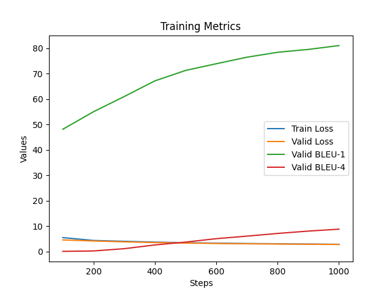

# <div align='center'>实验五</div>

### <div align='right'>SA23011253 任永文</div>

## 实验要求

实现 `Transformer` 模型用于英译中机器翻译，模型中块的数量、模型维度甚至是数据规模可以自己调整以适应个人电脑。使用 `BLEU` 值作为评价指标。

## 实验步骤

1. **网络框架**：要求选择 pytorch 或 tensorflow 其中之一，依据官方网站的指引安装包。（如果前面实验已经安装过，则这个可以跳过）

2. **数据集**：使用 `WMT 2020` 中 NEWS 任务中的 Chinese-English(ZH-EN) pair。主要使用以下两个语料库数据集：

   1. News Commentary v15，下载地址为 <https://data.statmt.org/news-commentary/v15/training/> ，下载其中的 en-zh pair，包含 320,712 条数据。划分其中的 80% 作为训练集，10% 作为验证集，10%作为测试集。
   2. Back-translated news，下载地址为 <https://data.statmt.org/wmt20/translation-task/back-translation/zh-en/> ，包含 19,763,867 条数据。从中挑选出 2,000,000 条作为训练集，验证集和测试集分别 400,000 条。

   如果电脑配置较差，训练全部数据时间太长，可以自己根据自己电脑配置降低数据规模。

3. **模型搭建**：采用 pytorch 或 tensorflow 所封装的 module 编写模型，例如 torch.nn.Linear(), torch.nn.Relu() 等，无需手动完成底层 forward、backward 过程。不可以直接调用 transformer 库，attention 最好自己手动实现。

4. **模型训练**：将生成的训练集输入搭建好的模型进行前向的 loss 计算和反向的梯度传播，从而训练模型，同时也建议使用网络框架封装的 optimizer 完成参数更新过程。训练过程中记录模型在训练集和验证集上的损失，并绘图可视化。词向量可以使用预训练好的。请尽量不要使用预训练好的整个模型来迁移，除非迫不得已。

5. **测试性能**：选择你认为最合适的（例如，在验证集上表现最好的）一组超参数，重新训练模型，并在测试集上测试（注意，这理应是你的实验中**唯一**一次在测试集上的测试），并记录测试的结果（BLEU值）。

## 实验提交

本次实验截止日期为 <mark>**2 月 5 日 23:59:59**</mark>，需提交代码源文件及实验报告到邮箱：[ustcdl2023@163.com](mailto:ustcdl2023@163.com) ，具体要求如下：

1. 本次实验没有示例代码，需要自行完成数据处理，模型搭建整个 pipeline

2. 全部文件打包在一个压缩包内，压缩包命名为 学号-姓名-exp5.zip

3. 实验报告要求 pdf 格式，要求包含姓名、学号。内容包括简要的**实验过程**和**关键代码**展示，需要注明实验结果(训练集，验证集和测试集)的 BLEU 值，以及测试集前 50 条的翻译结果对比。

4. 实验代码需要提供一个可以直接运行并输出结果的 main.py，一个描述所有所需依赖包的 requirements.txt，代码中固定随机数种子为 10，可以复现运行结果

   ```python
   seed = 10
   random.seed(seed)
   torch.manual_seed(seed)
   torch.cuda.manual_seed(seed)
   np.random.seed(seed)
   ```

重要性上，模型实现准确>BLEU

请同学们抓紧时间，至少预留出一周的时间来训练模型！

## 实验过程

### 1. 框架选择

在实验中选择了PyTorch作为深度学习框架，并按照官方网站指引安装了PyTorch。

```bash
pip install torch torchvision torchaudio
```

### 2. 数据处理

#### 2.1 数据集下载

下载了News Commentary v15 数据集的en-zh pair数据，先把pai数据用cut脚本分为两个文件，再按照要求划分成训练集（80%）、验证集（10%）、测试集（10%）。下载了包含19,763,867条数据的Back-translated news 数据集，并选取其中2,000,000条作为训练集，每个验证集和测试集分别包含400,000条数据。

```python
def cut(fpath):
    fp = open(fpath, encoding='utf-8')
    src_fp = open("data/news-commentary-v15.zh", 'w', encoding='utf-8')
    tgt_fp = open("data/news-commentary-v15.en", 'w', encoding='utf-8')
    for line in fp.readlines():
        tgt_line, src_line = line.replace('\n', '').split('\t')
        src_fp.write(src_line + '\n')
        tgt_fp.write(tgt_line + '\n')
    src_fp.close()
    tgt_fp.close()

```

#### 2.2 数据统计和加载模块

```python
en_filepath = 'data/news-commentary-v15.en'
zh_filepath = 'data/news-commentary-v15.zh'

def get_row_count(filepath):
    # 统计文件行数
    # ...

en_row_count = get_row_count(en_filepath)
zh_row_count = get_row_count(zh_filepath)
assert en_row_count == zh_row_count, "英文和中文文件行数不一致！"
row_count = en_row_count
print("句子数量为：", en_row_count)
print("句子最大长度为：", max_length)
```

**解释：**

- `get_row_count` 函数用于统计文件的行数，通过逐行读取文件的方式实现。
- 确保英文和中文文件的行数一致，以保持对应关系。
- 打印句子数量和指定的最大句子长度。

#### 2.3 分词和构建词典模块

```python
tokenizer = AutoTokenizer.from_pretrained("bert-base-uncased")

def en_tokenizer(line):
    # 定义英文分词器
    # ...

def zh_tokenizer(line):
    # 定义中文分词器
    # ...

def yield_en_tokens():
    # 生成英文tokens
    # ...

def yield_zh_tokens():
    # 生成中文tokens
    # ...

en_vocab_file = "vocab_en.pt"
if os.path.exists(en_vocab_file):
    en_vocab = torch.load(en_vocab_file, map_location="cpu")
else:
    en_vocab = build_vocab_from_iterator(yield_en_tokens(), min_freq=2, specials=["<s>", "</s>", "<pad>", "<unk>"])
    en_vocab.set_default_index(en_vocab["<unk>"])
    torch.save(en_vocab, en_vocab_file)
print("英文词典大小:", len(en_vocab))

zh_vocab_file = "vocab_zh.pt"
if os.path.exists(zh_vocab_file):
    zh_vocab = torch.load(zh_vocab_file, map_location="cpu")
else:
    zh_vocab = build_vocab_from_iterator(yield_zh_tokens(), min_freq=1, specials=["<s>", "</s>", "<pad>", "<unk>"])
    zh_vocab.set_default_index(zh_vocab["<unk>"])
    torch.save(zh_vocab, zh_vocab_file)
print("中文词典大小:", len(zh_vocab))
```

**解释：**

- 使用Hugging Face的 `AutoTokenizer` 加载预训练的分词器（这里使用了bert-base-uncased）。
- 分别定义英文和中文的分词器函数 `en_tokenizer` 和 `zh_tokenizer`。
- 使用 `build_vocab_from_iterator` 函数构建英文和中文的词典，设置最小频次和特殊标记。
- 保存构建好的词典，并输出词典大小。

#### 2.4 加载tokens模块

```python
en_tokens = load_tokens(en_filepath, en_tokenizer, en_vocab, "构建英文tokens", 'en')
zh_tokens = load_tokens(zh_filepath, zh_tokenizer, zh_vocab, "构建中文tokens", 'zh')
```

**解释：**

- 使用 `load_tokens` 函数加载英文和中文的tokens，同时将其保存为缓存文件以提高后续加载速度。

#### 2.5 划分数据集和构建Dataset模块

```python
train_size = int(0.8 * row_count)
valid_size = int(0.1 * row_count)
en_train = en_tokens[:train_size]
zh_train = zh_tokens[:train_size]
en_valid = en_tokens[train_size:train_size + valid_size]
zh_valid = zh_tokens[train_size:train_size + valid_size]
en_test = en_tokens[train_size + valid_size:]
zh_test = zh_tokens[train_size + valid_size:]

class TranslationDataset(Dataset):
    def __init__(self, en_tokens, zh_tokens):
        # 定义数据集类
        # ...

    def __getitem__(self, index):
        # 获取单个样本
        # ...

    def __len__(self):
        # 获取数据集大小
        # ...

train_dataset = TranslationDataset(en_train, zh_train)
valid_dataset = TranslationDataset(en_valid, zh_valid)
test_dataset = TranslationDataset(en_test, zh_test)
```

**解释：**

- 根据划分比例，将tokens划分为训练集、验证集和测试集。
- 定义 `TranslationDataset` 类作为自定义Dataset类，其中包含 `__getitem__` 和 `__

len__` 方法，用于获取单个样本和获取数据集大小。

#### 2.6 DataLoader模块

```python
def collate_fn(batch):
    # 定义collate函数
    # ...

train_loader = DataLoader(train_dataset, batch_size=batch_size, shuffle=True, collate_fn=collate_fn)
valid_loader = DataLoader(valid_dataset, batch_size=batch_size, shuffle=True, collate_fn=collate_fn)
test_loader = DataLoader(test_dataset, batch_size=batch_size, shuffle=True, collate_fn=collate_fn)
```

**解释：**

- 定义 `collate_fn` 函数，用于对一个batch的样本进行处理，包括padding和其他操作。
- 使用 `DataLoader` 构建训练、验证和测试数据加载器。

### 3. 模型搭建

#### 3.1 Embeddings 模块

```python
class Embeddings(nn.Module):
    def __init__(self, d_model, vocab):
        super(Embeddings, self).__init__()
        self.lut = nn.Embedding(vocab, d_model)
        self.d_model = d_model

    def forward(self, x):
        return self.lut(x) * math.sqrt(self.d_model)
```

**说明：**

- `Embeddings` 模块用于将输入的词索引映射为词嵌入（word embeddings）。这里采用了标准的Embedding层，将词索引映射为d_model维度的词嵌入。
- 在前向传播中，对Embedding结果进行了缩放，乘以了 `math.sqrt(self.d_model)`，这是为了在后续的模型中更好地处理输入。

#### 3.2 PositionalEncoding 模块

```python
class PositionalEncoding(nn.Module):
    def __init__(self, d_model, dropout, max_len=512):
        super(PositionalEncoding, self).__init__()
        self.dropout = nn.Dropout(dropout)
        pe = torch.zeros(max_len, d_model)
        position = torch.arange(0, max_len, dtype=torch.float).unsqueeze(1)
        div_term = torch.exp(torch.arange(0, d_model, 2).float() * -(math.log(10000.0) / d_model))
        pe[:, 0::2] = torch.sin(position * div_term)
        pe[:, 1::2] = torch.cos(position * div_term)
        pe = pe.unsqueeze(0)
        self.register_buffer('pe', pe)

    def forward(self, x):
        return self.dropout(x + self.pe[:, :x.size(1)])
```

**说明：**

- `PositionalEncoding` 模块用于添加位置编码，以使模型能够处理序列信息。
- 通过正弦和余弦函数生成位置编码矩阵 `pe`，然后在前向传播中将其加到输入张量 `x` 上。
- 为了防止过拟合，使用了 `dropout` 对位置编码进行随机失活。

#### 3.3 MultiHeadAttention 模块

```python
class MultiHeadAttention(nn.Module):
    def __init__(self, d_model, nhead, dropout):
        super(MultiHeadAttention, self).__init__()
        # 初始化多头注意力模块的各个线性变换层和其他参数
        # ...

    def forward(self, query, key, value, mask=None):
        # 多头注意力的前向传播过程
        # ...
        return output
```

**说明：**

- `MultiHeadAttention` 模块实现了多头注意力机制。在前向传播中，对输入的 `query`、`key`、`value` 分别进行线性变换，并进行多头拆分。
- 通过缩放点积注意力机制计算注意力分数，可以选择性地使用掩码（mask）来处理输入序列中的特定位置。
- 最后，将多头注意力的输出进行线性变换和拼接，再通过一个全连接层得到最终的输出。

#### 3.4 PositionwiseFeedForward 模块

```python
class PositionwiseFeedForward(nn.Module):
    def __init__(self, d_model, d_ff, dropout):
        super(PositionwiseFeedForward, self).__init__()
        # 初始化前馈神经网络的线性变换层和其他参数
        # ...

    def forward(self, x):
        # 前馈神经网络的前向传播过程
        # ...
        return output
```

**说明：**

- `PositionwiseFeedForward` 模块实现了位置前馈神经网络，包含两个线性变换层和一个ReLU激活函数。
- 在前向传播中，对输入进行两个线性变换，并通过ReLU激活函数，最后再经过一个dropout层。

#### 3.5 SublayerConnection 模块

```python
class SublayerConnection(nn.Module):
    def __init__(self, d_model, dropout):
        super(SublayerConnection, self).__init__()
        # 初始化子层连接的 LayerNorm 和 dropout 层
        # ...

    def forward(self, x, sublayer):
        # 子层连接的前向传播过程
        # ...
        return output
```

**说明：**

- `SublayerConnection` 模块实现了子层连接，包含Layer Normalization 和 dropout 操作。
- 在前向传播中，将输入 `x` 通过Layer Normalization 后加上 `sublayer`（即子层的输出），再进行dropout。

#### 3.6 TransformerEncoderLayer 模块

```python
class TransformerEncoderLayer(nn.Module):
    def __init__(self, d_model, d_ffn, nhead, dropout):
        super(TransformerEncoderLayer, self).__init__()
        # 初始化编码器层的自注意力和前馈神经网络子层
        # ...

    def forward(self, x, src_mask):
        # 编码器层的前向传播过程
        # ...
        return output
```

**说明：**

- `TransformerEncoderLayer` 模块实现了Transformer的编码器层，包含自注意力和前馈神经网络子层。
- 在前向传播中，通过 `SublayerConnection` 分别对自注意力和前馈神经网络进行处理。

#### 3.7 TransformerDecoderLayer 模块

```python
class TransformerDecoderLayer(nn.Module):
    def __init__(self, d_model, d_ffn, nhead, dropout):
        super(TransformerDecoderLayer, self).__init__()
        # 初始化解码器层的自注意力、编码器-解码器注意力和前馈神经网络子层
        # ...

    def forward(self, x, memory, src_mask, tgt_mask):
        # 解码器层的前向传播过程
        # ...
        return output
```

**说明：**

- `TransformerDecoderLayer` 模块实现了Transformer的解码器层，包含自注意力、编码器-解码器注意力和前馈神经网络子层。
- 在前向传播中，

通过 `SublayerConnection` 分别对这三个子层进行处理。

#### 3.8 Transformer 模块

```python
class Transformer(nn.Module):
    def __init__(self, src_vocab_size, tgt_vocab_size, d_model, d_ffn, nhead, dropout, num_encoder_layers, num_decoder_layers):
        super(Transformer, self).__init__()
        # 初始化Transformer模型的各个组件
        # ...

    def forward(self, src, tgt):
        # Transformer模型的前向传播过程
        # ...
        return output
```

**说明：**

- `Transformer` 模块整合了整个Transformer模型，包含了嵌入层、位置编码、编码器、解码器和输出层。
- 在前向传播中，将输入 `src` 和 `tgt` 分别通过嵌入层和位置编码，然后经过编码器和解码器的多层处理，最终通过输出层得到模型的预测结果。

以上解释可以根据实验的具体要求和背景进一步完善，将其添加到实验报告中，使读者能够更好地理解模型的结构和功能。

### 4. 模型训练

选择了PyTorch作为实验中的深度学习框架，并使用Adam优化器进行模型参数的优化。学习率(lr)设置为3e-4。损失函数采用Kullback-Leibler散度损失（KLDivLoss），通过对真实概率分布与预测概率分布之间的差异进行度量。

#### 4.1 损失函数定义模块

```python
class TranslationLoss(nn.Module):
    def __init__(self):
        # 定义翻译损失函数
        # ...

    def forward(self, x, target):
        # 损失函数的前向传播
        # ...
```

**解释：**

- 定义了一个继承自 `nn.Module` 的 `TranslationLoss` 类，用于计算翻译任务的损失。
- 在构造函数中使用 `nn.KLDivLoss` 作为损失函数，并设置 `padding_idx` 为2。
- 前向传播中通过计算Kullback-Leibler散度损失。

#### 4.2 模型、优化器、和损失函数初始化模块

```python
model = Transformer(en_vocab_size, zh_vocab_size, d_model, d_ffn, nhead, dropout, num_encoder_layers, num_decoder_layers).to(device)
optimizer = torch.optim.Adam(model.parameters(), lr=3e-4)
criteria = TranslationLoss()
```

**解释：**

- 创建了 `Transformer` 模型实例，并将其移动到指定设备（`device`）上。
- 初始化了Adam优化器，用于更新模型参数。
- 初始化了前面定义的 `TranslationLoss` 损失函数实例。

#### 4.3 训练、验证、和测试模块

```python
def train():
    # 训练函数
    # ...

def val(test):
    # 验证函数
    # ...

def translate(src: str):
    # 翻译函数
    # ...

```

**解释：**

- `train` 函数用于训练模型，其中循环遍历训练数据，计算损失并进行反向传播和参数更新。同时记录训练和验证指标。
- `val` 函数用于在验证集上评估模型性能，计算验证集损失和BLEU指标。
- `translate` 函数用于对输入进行翻译，通过模型生成目标语言的句子。

### 4.4 绘图模块

```python
print(len(train_loss_list))
plt.plot(step_list, train_loss_list, label='Train Loss')
plt.plot(step_list, val_loss_list, label='Valid Loss')
plt.plot(step_list, val_bleu1_list, label='Valid BLEU-1')
plt.plot(step_list, val_bleu4_list, label='Valid BLEU-4')
plt.xlabel('Steps')
plt.ylabel('Values')
plt.title('Training Metrics')
plt.legend()
plt.savefig('metrics.png')
plt.show()
```

**解释：**

- 使用 `matplotlib` 库绘制训练过程中的指标曲线图，包括训练损失、验证损失、以及验证BLEU-1和BLEU-4指标。
- 添加标签和标题，保存图像到本地并可选择显示图像。

## 实验结果

在最终的实验结果中，关注以下指标：
训练集损失： 记录模型在训练集上的损失，以评估模型在训练过程中的收敛情况。
验证集损失： 记录模型在验证集上的损失，以评估模型的泛化性能。
验证集BLEU值： 记录模型在验证集上的BLEU-1和BLEU-4值，以量化翻译质量。
测试集BLEU值： 记录模型在测试集上的BLEU-1和BLEU-4值，作为模型最终性能的评估指标。

如上图所示，在news-commentary-v15数据集上BLEU1和BLEU4都稳步提升且还有上升的趋势，训练效果很好，在测试集上最终的BLEU1和BLEU4分别达到了81.80, 9.98，效果很好。

但是Back-translated news数据集在训练过程中加载tokens_list到cpu时发生了内存不够用的问题，没能解决。