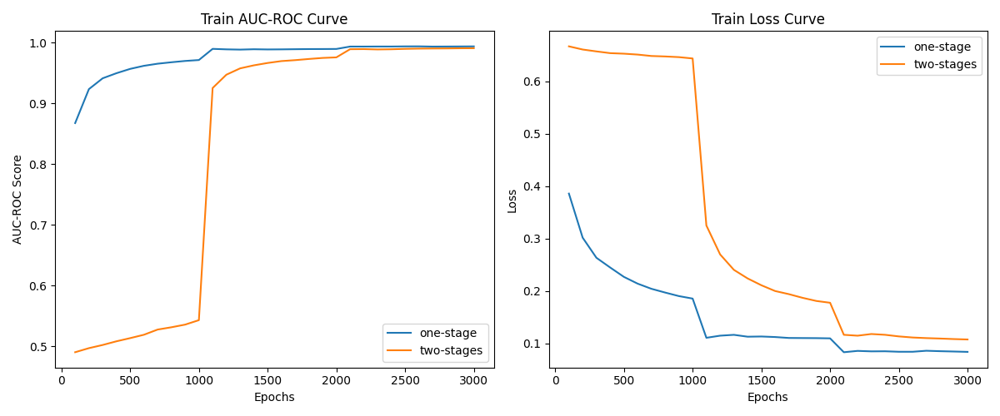

# 
综合实验

#### 
SA23011253 任永文 SA23011254 唐富根

## 实验要求

参加 [LLM - Detect AI Generated Text | Kaggle](https://www.kaggle.com/competitions/llm-detect-ai-generated-text/overview) 比赛 ，检测 AI 生成的文本。

## 实验提交

本次实验截止日期为 <mark>**2 月 5 日 23:59:59**</mark>，需提交代码源文件及实验报告到邮箱：[ustcdl2023@163.com](mailto:ustcdl2023@163.com) ，具体要求如下：

1. 全部文件打包在一个压缩包内，压缩包命名为 学号-姓名-expfinal.zip

2. 实验报告要求 pdf 格式，要求包含姓名、学号。内容包括对问题的理解和思考，解决方案的探索和设计，最终的比赛分数和排名。

3. 实验代码需要提供一个可以直接运行并输出结果的 main.py，一个描述所有所需依赖包的 requirements.txt，代码中固定随机数种子，可以复现比赛结果。

**注意**，比赛 1.23 就 close 了！

## 问题描述

帮助构建一个模型，用于识别哪篇文章是由初中和高中学生撰写的，哪篇文章是使用大型语言模型（LLM）生成的。随着LLMs的传播，许多人担心它们可能取代或修改通常由人类完成的工作。教育工作者特别担心它们对学生技能发展的影响，尽管许多人仍然对LLMs最终成为帮助学生提高写作技能的有用工具感到乐观。

在对LLMs的学术关切中，最前沿的问题是它们可能促使抄袭的可能性。LLMs经过大规模文本和代码的训练，这意味着它们能够生成与人类写作非常相似的文本。例如，学生可以使用LLMs生成并非他们自己的论文，从而错过关键的学习要点。您在这个比赛中的工作可以帮助识别LLM的特征，并推动LLM文本检测领域的最新技术。通过使用中等长度的文本，涵盖各种主题和多个未知的生成模型，我们旨在复制典型的检测场景，激励学习横跨模型的通用特征。

## 问题理解

容易看出这是一个对文本的二分类任务，并且判断文章是否是LLM生成的关键在于人类与LLM的语法习惯不同，因此想法是利用预训练大预言模型对语法的掌握来对文本分类，还需要考虑比赛给定数据集的特点具体分析。

## 方案设计

### 1. 扩展数据集

为了提高模型的泛化能力，我们可以考虑扩展数据集，包括更多不同主题和风格的文章。这有助于确保模型能够在多样性的情境下进行准确的识别。经过分析发现比赛给定数据集中共有1378条文本数据，但其中仅有3条是LLM生成的，其他都是人类文本，类别分布十分不均衡，因此我们利用了扩展数据集train_v4_drcat_01，该数据集中有73573条文本数据，其中人类文本有27370条，数据更多且类别分布更均衡，方便后续实验。

### 2. 预训练大语言模型

预训练大型语言模型是一种基于深度学习的自然语言处理模型，在大规模文本数据上进行预训练以学习语言的表示和语义理解，能捕捉输入文本中的复杂关系和语境。本实验中利用了预训练过的大型语言模型[bert-base-uncased](https://modelscope.cn/models/sdfdsfe/bert-base-uncased/summary)作为基础模型，利用给定数据集作为下游任务对bert-base-uncased进行微调，有助于更好地区分学生和LLM生成的文本。

### *3. 分阶段训练

由于本实验的下游任务是对文本进行分类，而使用的预训练模型bert-base-uncased使用的BertModel缺少分类这一步骤，因此我们具体实验过程中使用了BertModel的改进模型BertForSequenceClassification，该模型在BertModel的基础上加了一个用于分类的线性层classifier。考虑到BERT中的参数经过训练而classifier中的参数没有经过训练，这两部分参数不在同一个阶段，因此，本实验使用分阶段训练的思想，先只训练classifier而冻结bert中的参数直到收敛，此时两部分参数处于同一阶段，再对两部分同时训练直到收敛。

## 实验结果

实验按照1：9的比例对数据集随即划分生成训练集和测试集，为了验证分阶段训练对结果的有效性，设计了对比试验分别记录了分别使用两种策略的情况下模型在训练集和测试集上的性能，评估指标包括loss和auc-roc，并绘制了学习曲线。

### 训练集结果

在训练集上从曲线中明显可以看出分阶段训练在第一阶段收敛较慢，但是在第二阶段很快收敛，并且在loss还未完全收敛有下降空间的情况下auc-roc逼近单阶段训练的效果。

### 测试集结果

|策略|loss|auc-roc|
|----|----|-------|
|one-stage|0.231|0.937|
|two-stages|0.764|0.976|

在测试集上，单阶段和分阶段训练的auc-roc分别是0.937和0.976，可以看出分阶段训练一定程度上解决了过拟合的问题，在此任务中表现更好，但是测试集上的loss比训练集都要高很多，表明有过拟合的情况。

### 比赛结果
错过了比赛时间，但是在平台上提交后得到的成绩如下，比较满意。

|id	|generated|
|-------|----------|
|0000aaaa	|0.9792868|
|1111bbbb	|0.9710072|
|2222cccc	|0.9674946|

## 实验总结

通过这个实验，我们深入了解了处理LLM识别文本真假的挑战，并提出了一种综合的解决方案。实验结果表明，分阶段训练的方式对结果有效果，对预训练模型的表现有较大的提升，但是仍然存在过拟合的情况，需要在之后的探索中去解决。
