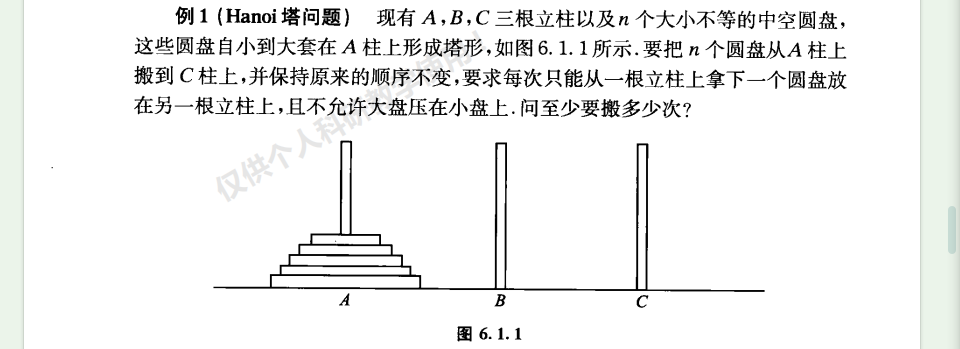
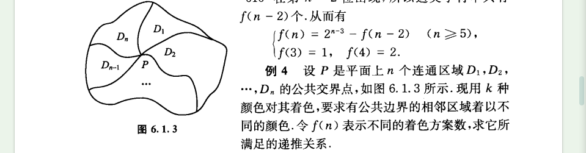
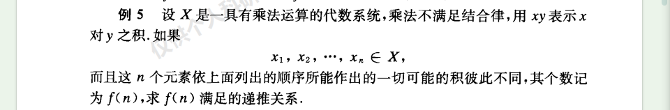
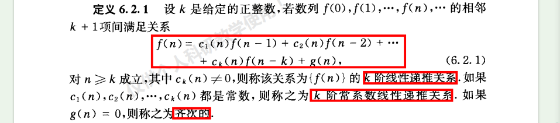
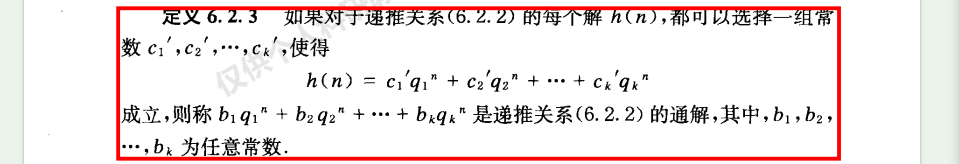
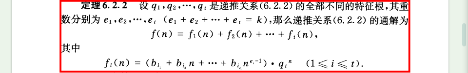
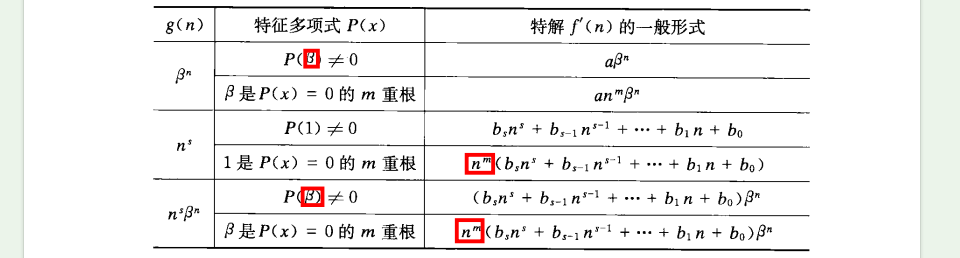
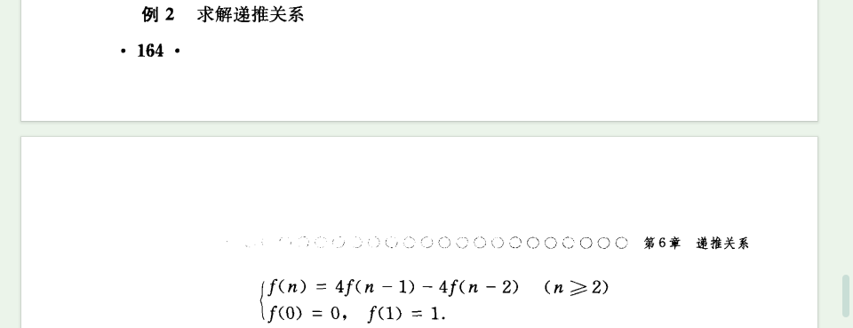

# 第6章 递推关系
## 6.1 递推关系的建立
### 定义

### 例题

## 6.2 常系数线性齐次递推关系的求解
### 定义

### 定理

### 例题

## 6.3 常系数线性非齐次递推关系的求解
### 定理

### 例题

## 6.4 用迭代归纳法求解递推关系
### 例题

例5有问题

## 6.5 用生成函数求解递推关系
### 定理

### 例题

