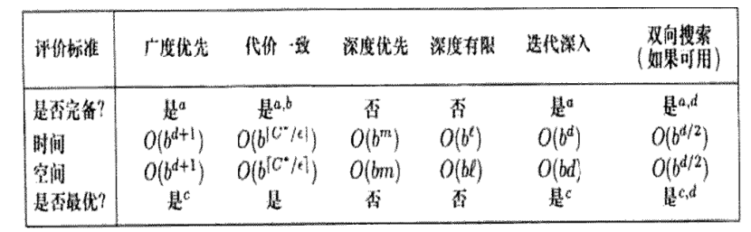

# 
高级人工智能期末复习

## 
一、函数与复杂性

### 函数

* 什么是函数
* 函数的表示
    1. 函数表示的评价：精确性、简洁性和使用方便性
    2. 函数表示：解析表示、列表法、图像法、语言叙述法
* 从函数到知识
* 计算机中的函数

### 函数描述的复杂性

* 函数描述
    1. 完全描述和部分描述
    2. 最耗费空间的函数描述方法
* 函数描述的复杂性到AI的复杂性
    1. 函数描述复杂性的决定因素：列数、每列的值域大小
    2. 解决问题步骤：建模、模型求解、模型使用
* 从问题求解的复杂性到AI的主要研究问题
    1. 建模——手工、模型求解——学习问题、模型使用——搜索问题
* 复杂性：朦胧的感性认识尝试上升到理论高度到实际应用的一个例子
    1. 奥卡姆剃刀原理——最小描述长度——柯尔莫哥洛夫复杂性
* 函数和描述的评价
    1. 评价标准：完备性、描述长度、准确性
* AI、函数和其他

## 
二、问题求解：搜索

### 搜索的定义

* 搜索的定义
    1. 搜索问题的五要素：状态空间、后继函数、初始状态、目标测试、路径耗散
* 搜索问题与状态图
    1. 用状态图来描述搜索问题
* 搜索问题：状态的解释
    1. 构建“好的”状态空间
    2. 何谓“好的”状态：减少不可达状态，减小状态空间大小，方便设计后继函数和搜索算法
* 搜索问题：后继函数的解释
    1. 从可行“行动”集合中选择行动到达后继状态
    2. 问题建模的关键！最复杂的部分
* 搜索问题：路径耗散的解释
    1. 可以是后继函数的执行代价或奖励
* 搜索问题：初态和终态的解释
    1. 初态：单源或多源（共同性质）
    2. 终态：一个或一些（某些条件），可以是集合
* 搜索问题：解的解释
    1. 从初态到终态的路径与最短路径——解与最优解
    2. 初态和终态结点在两个连通分量中——无解

### 具体问题转化为搜索问题

* 三国华容道
* n^2-1数码问题
    1. 状态图根据逆序值奇偶分为两个连通分量
* 数独游戏
* 三国华容道的计算机求解
    1. 建模（状态，移动，数据结构）和编程
* n皇后问题的形式化
    1. 两种形式化方法——是否约束每次放置的位置，状态数目急剧减少
    2. “约束满足问题”、规模大状态多、爬山法
* 路径规划问题形式化
    1. 三种形式化方法——网格化、扫描线方法、障碍物边界法

### 搜索算法设计

* 问题求解：应用计算机技术
    1. AI和数据结构
* 搜索：通用问题求解
    1. 人类解决问题的过程是一个搜索过程
* 编程求解搜索问题
    1. 图的宽度优先遍历为搜索问题的基准算法
    2. 我们关心的搜索算法与基准算法对比，搜索状态图的一小部分就能获得解或最优解
    3. 状态与节点：状态图中结点若能被重复访问，则搜索树无限深
* 搜索算法：数据结构设计
    1. 有了模型（逻辑结构，状态图）后设计数据结构
* 搜索算法：节点扩展
    1. 评估后继函数，对所有后继状态产生子节点
* 搜索算法：搜索树的边界
    1. FRINGE：存储以访问过状态的后继结点中未扩展的
* 搜索算法：搜索策略
    1. FRINGE中节点的优先次序，设计INSERT和REMOVE函数
* 搜索算法：算法框架
* 搜索算法：评估算法性能
    1. 完备性
    2. 最优性
    3. 复杂性：重要参数：分支因子b，最浅目标状态的深度d
* 搜索算法设计的目标
    1. 根本目标：解决问题
    2. 任何一个算法在所有问题实例上的平均性能是相同的
    3. 对每个实例找到其最有效的求解算法

## 
三、盲搜索

### 基准算法

* 搜索算法：算法框架
* 有/无信息搜索算法
    1. 无信息FRINGE无序，有信息将有希望的结点优先扩展
* 基准算法的进一步解释
    1. 基准算法是盲搜索算法，新节点插入到FRINGE队尾

### 基准算法的各种改进

* 双向搜索算法
* 深度优先搜索
* 回溯法
* 深度受限深度优先算法
* 迭代深入搜索
* 代价一致搜索
* 盲搜索算法比较
* 避免状态重复访问
    1. 状态被重复访问的原因：行动可逆
    2. 基准算法：设置标记数组/丢弃扩展过的结点
    3. 用CLOSED表和OPEN表
    4. 树搜索和图搜索
    5. 状态空间无限或允许被重复访问，则搜索不完备；若可被丢弃则完备但不最优

## 
四、启发式搜索

### 启发式搜索基础

* 启发式搜索：最佳优先搜索
    1. 最佳优先搜索：从 FRINGE 中选择最佳节点进行扩展
    2. 评估节点的优劣：利用状态/节点信息或描述来度量
    3. 设计节点评估函数 f 的两种方法
    4. 节点评估函数 f 的设计，核心在于启发式函数 h 的设计
    5. h(N)应保证的性质：h(N)>=0,h(Goal)=0,h(N)越小，离目标越近

### 启发式搜索的例子

* 机器人导航问题
* 数码问题
    1. h1(N)=错误放置的格子数 可采纳的 一致的
    2. h2(N)=所有数字到其正确位置的Manhattan距离之和 可采纳的 一致的
    3. h3(N)=逆序数之和 不可采纳的。
* 路径规划问题
    1. Euclidean distance 可采纳的 一致的
    2. Manhattan distance 不允许沿对角线移动，则是可采纳的 一致的；否则是不可采纳的 不一致的

### 启发式搜索的设计

* 可采纳启发式函数
    1. 假设h∗(N)是节点N到目标节点的实际最优路径耗散
    2. 启发式函数h(N)是“可采纳的”，当且仅当0≤h(N)≤h∗(N)
    3. 总是“乐观地”估计路径耗散！！！
    4. 松弛问题：放宽问题的限制（约束），减少行动限制，获得更好的解，原问题的解仍在松弛问题的可行域中。
    5. 反证法：找一个违背可采纳定义的状态
* 一致的/单调的启发式函数
    1. 对一个可采纳的启发式函数h，若它对所有节点都满足三角不等式，即h(N)≤c(N,N′)+h(N′)，其中 N′是N的后继节点，则h是一致的或单调的。c(N,N′)是节点N到N′的单步路径耗散。
    2. 随着搜索的深度越来越深，对深处节点估计的启发式函数值越来越准确！！！

### 设计启发式函数的例子：A*算法

* A*算法的定义
    1. f(N)=g(N)+h(N),其中g(N)=从初始节点到N的路径耗散，h(N)：从N到目标节点的路径耗散
* A*算法的性质
    1. 性质1：完备性——若A∗算法结束，问题有解，则一定会返回一个解
    2. 性质2：最优性——A∗选择某个目标节点扩展，则到此目标节点的路径一定是最优的
    3. 性质3：对一致的h，A∗算法扩展一个状态节点时，到该状态的路径一定是最优的
    4. 性质4：准确性——可采纳的启发式函数h1,h2对任何节点，h1≤h2 则称h2比h1准确，精确的启发式函数扩展的节点更少一些
* A*算法的评估
    1. 有效分支因子b*
* A*算法的目标
    1.目标：精确的、一致的启发式函数
* A*算法的改进
    1. 迭代深入A∗算法：IDA∗：设置f的阈值，超过f的阈值，节点不再扩展；迭代执行A∗，降低A∗算法对内存的需求
    2. IDA∗ 改进为 SMA∗：把内存用光，不能保存节点了，丢掉保存的一个高耗散，最旧的节点，再插入新的节点，这个算法称为：SMA∗

## 
五、优化问题

### 优化问题的描述

* 优化问题描述
    1. 目标函数和约束条件
* 优化问题形式化为搜索问题
    1. 形式化方法：解当成状态/部分解或完整解当成状态
    2. 若x是一个向量或由多部分组成，按照分量是否全部赋值分为部分解和完整解
    3. 数值优化问题：minf(x)=ax^2+bx+c,a>0
    4. 组合优化问题：MaxSAT
* 优化搜索问题
    1. 优化搜索问题的解：不需要返回路径，返回终态即可
* 优化问题：地貌图
    1. 状态空间的编码和后继函数的设计相关、重要！
    2. L=(S，f，N)

### 优化搜索问题求解算法

* 全局和局部搜索算法
    1. 后继函数是状态空间的子集\整个状态空间
    2. 状态图不是\是完全图
    3. 边权值为概率，表示状态间转移概率\边权值为1
    4. 局部搜索算法：爬山法、梯度下降法、禁忌搜索、局部剪枝搜索、模拟退火
    5. 全局搜索算法：模拟退火、遗传算法、蚁群算法
* 梯度下降法
    1. 设置算法停止准则T和下降步长λ，设置初态X0，循环迭代
    2. 不能保证全局最小解，参数设置需要人工经验
    3. 直线搜索：不知道如何设置步长，就用各种步长来尝试（λ设置为一个集合）
    4. 随机梯度下降：计算梯度只用一个随机样本信息，时间性能提升，代价是循环次数增多
* 牛顿法
    1. 寻找函数g(X)的根X∗，使得g(X∗)=0，快速对可导函数求根
* 爬山法
    1. 非常简单、高效的算法，内存需求少，两个关键因素：初始解和邻居算子N(·)的定义，策略s，常见的有：**best-found（梯度下降的离散化）：** 在N′(Xc)中选择g(·)最小的；**first-found（随机梯度下降）：** 随机在N′(Xc)中选择一个，实际实现上述算法时，不需要求出整个N′(Xc)，在对Xc的邻域遍历时，遇到第一个更好的邻居时，本次循环就结束；**Random Walk:** 在N(Xc)而非N′(Xc)上随机选择一个当成下次循环迭代的Xc ，一种随机采样
    2. 爬山法的改进算法1：用不同的随机初始值重启算法
    3. 爬山法的改进算法2：“变”邻域结构 比如迭代爬山法，到达局部最优解后，调整邻居算子，实现“扰动”，然后再回到局部搜索
    4. 爬山法的改进算法3：LBS/局部剪枝搜索: 爬山法的并行改进 初始时刻，开始 k 个随机种子/初始值/初态，准备执行爬山法 **策略一：** 在所有lk个后继中选择最优的k作为当前的k个解 **策略二：** 所有lk个后继对应一个被选择的概率分布，例如选择目标值在所有后继目标值中占比最高的k个后继
* 模拟退火(=爬山法+随机行走)
    1. 小概率允许“坏”的移动，而不是像爬山法一样，每次都选最好的移动
    2. 概率p：开始时刻，温度较高，有较大概率移动到“坏”解，随着搜索的进行，温度降低，移动到“坏”解得概率指数下降；公式：p = e^−∆g/T ，其中 ∆g=g(X′)−g(Xc)是解和它的邻居的目标函数之差
    3. 温度 T 的下降过程，称为 schedule,可以证明，T下降得足够慢，算法找到最优解的概率逼近1
* 禁忌搜索
    1. 一个长度有限的（不妨设为 k）最近历史解列表 Tabu − list（用队列实现）在搜索过程中，发现的新解如果出现在 Tabu − list，直接放弃,Tabu − list 能一定程度上防止在局部最优不动了
* （1+1）-EA（进化算法）
    1. 全局领域算子，在状态空间中随机选择一个解为Xc的后继状态 X′
    2. 可能不同解之间的跳转概率不一样
    3. 改进：类似于LS→LBS，λ个(1+1)−EA并行执行
    4. EA: 后继函数的设计：后继在全局范围内/整个解集范围内
    5. EA: 状态空间的设计/编码 → 遗传算法/遗传规划
* 重新审视搜索问题
    1. 构造性算法（解的各个部分/分量逐步被构造出来）
* 蚁群算法
    1. 有限状态机：状态图引入时序、输出、输入、代价和状态转移等概念
    2. 把有限状态机看成是状态图，在其上定义新的搜索问题：寻找遍历所有节点的路径，使得路径的某个属性达到最小
    3. 动机：解的哪一个成分更重要？哪一个成分的哪个取值更重要？所谓“重要”即更小的代价获得更多的“收益”，heuristic?
    4. 思路：分布式的策略来估计；让n只蚂蚁在有限状态机上爬行，并留下“信息素”，来标记爬行历史；该过程迭代重复；在评价好的“状态转移”边上，将会有跟多的蚂蚁在上面爬行，留下信息素；

## 
六、约束满足问题

### 例子

* 地图着色问题
    1. 用 k 种色彩对地图着色
    2. 优化问题？NO! 搜索问题？YES!
* CSP问题
    1. 形式化定义 CSP = (X,D,C)，是一个三元组
* CSP的例子
    1. 3-SAT
    2. 地图着色
    3. 八皇后问题
    4. 推理问题
* CSP问题分类
    1. 有限和无限 CSP：解的数目是否是有限的

### CSP问题建模

* 将CSP问题形式化为搜索问题
    1. 符号和概念定义 有效赋值和完全赋值
    2. 系统化方法 **状态空间：**所有可能有效赋值、**初始状态：**{},k = 0、**后继函数：** k+1、**目标测试：** k = n、**路径耗散：** 假设单步路径耗散为 1
    3. 后继函数：剩下n−k个变量，不妨设每个变量的取值个数相同，都是s，则有b=s×r个后继，即分支因子是b
    4. 可交换性——变量的赋值次序和完全赋值的可达性无关 **带来的好处之一：** 扩展节点的时候，任意选择一个未赋值的变量，考查其所有可能的赋值即可（扩展节点）**带来的好处之二：** 不需要存储到达当前节点（已有有效赋值）的路径，所以可用回溯算法（使用递归的简化深度优先算法）

### CSP问题求解算法

* 回溯算法
    1. **基础算法框架：CSP-BACKTRACKING(A)** X←选择一个未赋值变量;D ← 选择一个 X 所有可能取值的次序，例如随机次序
* 改进回溯法1
    1. 前向校验技术——检测冲突让冲突早点来 每增加一个变量的赋值，引发了某些未赋值变量取值范围的缩小，确定这些变量缩小的变量取值范围，一旦某个变量的取值范围为空集{}，则发现了“冲突”，这就是“前向检验”
    2. **改进的回溯算法1：CSP-BACKTRACKING(A,D¯A)** 新值域D¯A←forward−checking(D¯A,X,v,A);if D¯A的每个变量的值域都非空 then
* 改进回溯法2
    1. 下一步选择哪个变量进行赋值？**启发式函数1：**选择约束最强的变量/残留值域最小的变量 理由：分支因子最小，后继最少！**启发式函数2：**选择“最多被约束着的变量” 理由：使将来残留值域缩减得更多！降低分支因子
    2. 变量 x 选择出来了，如何给其残留的值域排序？**启发式函数3：**选择“最少被约束着的值”，对每个不同的v，都需要进行前向检验，然后检查哪个v 值对残留值域大小的影响小！
    3. **改进的回溯算法2：**用启发式函数1和启发式函数2来选择未赋值变量，用启发式函数3来选择变量的取值
* 改进回溯法3
    1. 约束传播: 更好的冲突检测机制或方法
* 进一步加速CSP求解算法：约束图
    1. 每个变量是一个节点，变量间连边，构成图

### CSP的应用

* CSP的应用
    1. 一些例子：教务处排课、电路布局设计、任务调度...
    2. 优化问题 =⇒CSP 问题 未知最优解的最优化问题，不知道什么时候搜索停止；实际工程中，往往可以设置一个可接受的解的质量水平，将这个解质量看成是一个约束条件，最优化问题的优化目标就转化成了约束条件，得到了一个 CSP

## 
七、机器学习

### 从例子开始

* 牛顿力学定理的发现：力、质量、速度的函数关系
    1. 收集实验数据，填入“表格”（不完整的函数关系）
    2. 假设函数关系，验证函数关系
    3. 发现的函数关系是“知识”，规律，是压缩实验数据表格的“压缩方法”
* 无人自动驾驶
* 推荐系统
* 基因识别
* 语言学习
* 西洋双陆棋

### h的定义

* 机器学习的含义
    1. 含义1：获得完整的数据表格
    2. 含义2：压缩完整表格的存储空间
* 机器学习定义
    1. 机器学习：寻找 f 近似值 h 的过程
* 函数描述方法
    1. 表格描述
* 函数f的近似值h
    1. 机器学习的对象与结果：h
    2. 建模/学习：模型选择与训练

### h的评估

* 如何评价h的优劣
    1. 准确性：h 和 f 之间的差异
    2. 复杂性：h 的描述长度是多少？
    3. 完备性：h 是否对 f 的每个输入都定义了一个响应？
* h的准确性
    1. h 准确性的定义：绝对误差、平方误差、误差计数
    2. 对所有的输入，比较 f 和 h 输出的差异, 然后求和；**问题1:**值域太大**问题2：**误差和x的值域大小相关，通常将上述误差除以x值域大小，得到误差均值。实际应用中用**测试数据集**的错误率，近似估计h的错误率
* h的复杂性
    1. 机器学习中最重要的、最简单的 h 也是线性模型
    2. y = Wx，x 是标量，W 是线性表达式的系数，· 表示内积/点积

## 
八、线性回归

### 从例子开始

* h如何获得
    1. 手写体数字识别：问题描述
    2. 手写体数字识别问题分析 1: f 是什么？
    3. 手写体数字识别问题分析 2: h 是什么？
    4. 手写体数字识别：解决问题 搜索最优的 W 和 b（最小二乘法）
* 输入变量x的预处理
    1. h(x) = W·x + b ⇒ h(x) = W·ϕ(x)（特征提取函数）

### 损失函数

* h的获得（以下我们仅考虑线性h的情形）
    1. 从评价标准：准确性出发
    2. 线性h的一行/定义域/训练集上/测试集上所有损失函数之和
    3. 训练集损失原因：h不准确、数据集有噪声
* 基于残差定义损失函数
    1. 若令y=f(x),定义：W·ϕ(x)−y为残差
    2. 绝对损失：loss1(W,f,x)=|f(x)−h(x)|=|W·ϕ(x)−f(x)|

### 最小化损失

* 最小化训练集上的损失之和
    1. 测试集不能被直接使用，只能用在最后的评估过程中
    2. 寻找最优的 W，使得 TrainLoss(·) 最小。寻找一个 W，减少某个样本的残差，容易; 寻找一个 W，减少所有样本上的残差，困难，可能不同的样本对 W 的要求有冲突。
* 损失函数的选择
    1. 考量方面 **平方损失函数：**近似寻找y的均值，综合所有样本的影响 **绝对损失函数：**近似寻找y的中值，抵抗离群点/样本的影响
* 最小化问题求解算法
    1. 梯度下降法、随机梯度下降法（只用了一个随机样本的信息，时间性能得到提升，付出的代价是更多的循环次数）
    2. Ws+1 =Ws−λs∇W((Ws·ϕ(xi)−yi)2)

## 
九、线性分类

### 从例子开始

* h如何获得
    1. 电子邮件地址识别：问题描述（输入输出）
    2. 电子邮件地址识别：特征提取函数
    3. 电子邮件地址识别问题分析 1: f 是什么？
    4. 电子邮件地址识别问题分析 2: h 是什么？
    5. 权向量 W 的解释
    6. 分数score：两个向量的点积/内积h(x) = W·ϕ(x)
    7. 从分数score到输出y：将“分数”离散化为 {−1 + 1}
    8. 电子邮件地址识别：总结  问题描述、问题分析：特征提取，h 选择线性函数、问题求解：最优 W 的确定、及其意义的说明、分数定义及其到输出响应 y 的变换等。

### 分类

* 分类的几何意义
* 间隔的定义
    1. 分数 score ≜ W·ϕ(x)，描述了对 f 的输出 y 进行预测时，对预测结果有多大程度的“信任”，是个打分
    2. 间隔 margin ≜ W·ϕ(x)y，表示对 f 的输出 y 进行预测时，对预测结果的正确性有多大把握
* 间隔的几何学意义
    1. 间隔：平面外点P到平面的距离的||W||倍
* 基于间隔定义损失函数
    1. 简单粗暴的方法：符号函数 sign(·)
    2. 改进方法：软判决，使得梯度信息存在且有意义loss_logistic (x,y,W)=log(1+e −W·ϕ(x)y)
    3. 改进方法：把关键部分的梯度信息变成非 0 loss_hinge (x,y,W) = max{1−W·ϕ(x)y,0}

### 线性SVM

* 代数间隔与几何间隔
    1. 代数间隔：a − margin ≜ W·ϕ(x)y
    2. 几何间隔：g − margin ≜ W·ϕ(x)y/|W|
* 重定义最优化问题
    1. 追求代数间隔大于等于1，使得hinge损失为最小值 0
    2. 用几何间隔来描述，即W·ϕ(x)y/|W|≥1/|W|，即任何一个数据点，它到分类面的距离≥1/|W|
    3. 新优化问题描述：约束条件：找到一个分类面h(x)= W·ϕ(x)，使得它能分开所有的训练数据，且使得任意一个数据点到分类界面的几何间隔≥1/|W|，优化目标：1/|W|越大越好
* 不同分类面的例子
    1. 支持向量：离超平面最近的点
    2. 非支持向量：当你选择的W发生改变的时候，有些非支持向量就会变成支持向量，约束你选择的W确定的决策面及对应的支持向量间的距离达到“最大”
* 线性SVM定义
    1. 线性 SVM 优化问题：min|W| s.t. (W·x+b)y≥1,∀(x,y)∈Dtrain
* 拉格朗日乘子法
    1. 对约束条件的处理 [1−(W·xi+b)yi]αi=0,∀(xi,yi)∈Dtrain，支持向量αi取值可以随意变化；非支持向量必须要让αi=0
    2. 对目标函数的处理L(W,b,α)≜1/2W·W +∑(xi,yi)∈Dtrain[1−(W·xi+b)yi]αi
    3. 有没有更好一点的方法来求L(W,b,α)的最小值？maxα∑αi −1/2∑αiαjyiyjxi·xj s.t. ∑αiyi=0,∀αi≥0 因为非支持向量的αi为 0，所以目标函数公式(1)中仅仅包支持向量间的内积运算 W =∑αiyixi,b=yi−W·xi,∀(xi,yi) is a SV
* SMO序贯最小化算法
    1. 算法思想：每次固定m−2个乘法因子αi，让其余两个任意变化，寻找这两个任意变化乘法因子的最佳值；循环迭代调整固定不同的m−2个乘法因子α，直到收敛
* 线性SVM求解
    1. 时空复杂性：线性空间需求，参照数据集大小m 时间代价：数据集大小的若干倍
* 新的损失函数，新的算法
    1. 平滑L1损失：降低L1损失函数中离群点的影响
    2. 交叉熵：适用于分类问题 H(P,Q) = −∑Pi*log(Qi)，P 是训练数据集中各类数据的比例/概率，Q 是分类器算出的输入数据属于各类的“概率”

## 
十、非线性处理

### 非线性SVM

* 问题描述
    1. 线性不可分或不同类支持向量靠得太近，原因可能是测量误差造成的噪声
    2. 我们将某些数据看成是有噪声的，在他们被选择为支持向量时进行“松弛”
* 松弛变量法
    1. 约束条件：∀(xi,yi)∈Dtrain 1≤(W·xi+b)yi=⇒1−ξi≤(W·xi+b)yi
    2. 目标函数：=⇒ minW,ξ(1/2 W·W+C∑ξi)
    3. 训练误差：原来线性可分时，误差为 0=⇒∑ξi
    4. 添加ξi把xi拉回“支持向量”边界，称ξi为松弛变量
    5. 被平移的数据点，虽然成了sv，但是带来了训练误差，非支持向量带来0误差
    6. 两类支持向量，它们的拉格朗日乘法因子αi>0，真正的sv和平移后的sv
    7. 当获得最优解时，ξi=1−(W·xi+b)yi ，这就是样本 (xi,yi)的 hinge 损失
    8. min(1/2 W·W + C∑ξi)，也即 min(1/2C W·W +∑loss hinge )， min1/2 W·W 被称为正则化项控制模型复杂性，训练集上的hinge 损失∑ξ i称为训练误差最小化项，参数C，用于平衡两个优化目标之间的相对重要性
* 非线性可分
    1. 如何映射到高维空间/特征空间？如何确保在高维空间中线性可分？ 聚焦在“特征提取函数”！
* 特征提取函数
    1. 特征提取函数可以把在低维空间中线性不可分的数据集映射到高维空间，可能实现线性可分。
    2. 线性不可分可能变成线性可分；时间和空间代价增加，把数据集变换为新的高维空间的数据集。
* 线性SVM处理非线性情形
    1. 存在这样的超平面，可以完美地将数据分开, 那么h(x) =∑αiyiϕ(xi)·ϕ(x)+b, where (xi,yi) is a sv，获得分类器 h 后，对任何新数据进行预测时，只需要将它与支持向量进行内积，然后求加权和即可。
    2. 如果不存在这样的超平面，如果能直接获得K(xi,x)= ϕ(xi)·ϕ(x 的值，不需要显式地先分别计算出ϕ(xi),ϕ(x)，然后求内积，就可以避免一些特征提取函数带来的时空代价！
* 核函数
    1. 称K(xi,xj)为核函数，它等于xi,xj两个变量升维（特征提取 < 怎么提取的？不关心！>）后的特征向量的内积；在线性 SVM 优化过程中，出现特征向量的地方，都是求两个特征向量的内积。
    2. K(x,a)=(1+ x·a)^2 多项式核函数
    3. K(x,a) = x·a 内积核函数
    4. K(x,a) = e −(x−a)^2 /2σ^2高斯核函数
    5. 核函数是我们“假设存在一个特征提取函数，把数据集映射到了高维特征空间”，核函数就是高维特征空间的内积计算公式；

### K近邻方法

* K近邻方法：样本增加
    1. 训练样本数目越多，分类精度越高
* K近邻方法：边界更复杂
    1. 样本越多，决策边界越复杂，很多直线组合在一起，用非线性边界划分了整个平面
* K近邻方法：K的影响
    1. K 越大，边界越光滑
* KNN：算法描述
    1. 训练过程:将所有已知样本存储起来。预测/分类过程: 在给定距离定义下，计算新数据/未知类别数据的K个最近邻居,以K个邻居中占多数的类标号作为新数据的类标号。
    2. 优点：训练简单 可解释性好  缺点：预测代价大，找最近的K个邻居，算法时间复杂度不低 样本数目太少时，易过拟合，泛化能力不足
* 参数方法与非参数方法
    1. 非参数方法：参数的个数随样本数目增加而增加
    2. 参数方法：相对应的参数方法，参数个数是固定的
* KNN算法扩展
    1. 机械学习算法：KNN 预测新数据代价太大
    2. 训练过程：存储所有的训练样本 预测过程：随机产生类标号给新样本/或直接返回“不知道答案”
    3. 训练过程：找到训练集中出现次数最多的 y 值 预测过程：对任何新样本，其类标号为该 y 值
* 一些概念的整理
    1. 过拟合与泛化能力
    2. 模型/假设的复杂性和正则化
* KNN与SVM的比较
    1. SVM 只是用核函数定义了一种新的距离计算公式，压缩了KNN 的大量样本，保留了一些关键样本（sv）用于构建分类器/距离计算公式，而 KNN 设计的关键之一就是定义合适的距离计算公式。

### 决策树

* 决策树描述
    1. 决策树静态结构:树形结构，每个节点是一个简单的线性决策器hi(x)=Ai，依据属性Ai的取值不同划分为不同的类；决策树中任意一个非叶节点有两个特点：拥有一个训练数据集的一个子集Di，对应数据的一个列/属性（称为分割属性）；决策树中任何一层中所有节点的训练数据子集互不相交，且并集为完整的训练数据集；叶节点不包括任何数据，只有一个标记父节点中数据所属的类别号。
    2. 决策树动态部分：训练过程：即构建决策树的过程，确定每个非叶结点的分割属性，并分割节点拥有的数据子集给孩子节点；分类/预测过程：沿从树根开始到叶节点的一条路径，依次使用路过节点的线性分类器；一种特殊“树形”组合多个线性决策器的方法。
* 决策树的构造
    1. 在初始时刻，构建树根节点，树根拥有所有训练数据 Dtrain
    2. 对任何一个节点Ni，选择数据的某一个属性/特征A，以A的不同取值，把节点Ni拥有的训练数据集Di分成若干个不相交的子集，每个子集变成节点Ni的一个子节点（每个子节点拥有训练数据的一个子集）；
    3. 当某个节点内的所有训练数据都属于同一类（y 值相同）时，该节点的划分过程结束，它生成唯一一个子节点（叶节点），叶节点只有一个属性：它的父节点拥有的数据集所属的类标号。
* 关键技术一——分割属性的选择
    1. 纯：意指分割完后的子集异类的数据越少越好，将来可以很快地把“不纯”的数据划分掉，降低子集未来划分出的节点数目
    2. 不纯：比“纯度”的定义和计算更直接和简单一些。集合内的数据全部属于一类，则不纯度为 0，均匀来自 2 类或多类，则不纯度最大
* 不纯性的度量方法
    1. 熵不纯度——ID3 算法/C4.5 算法：信息熵H即对数期望值−∑pi logpi，量化随机变量的不确定性。计算信息增益H(N)−H(N|Ai)，信息增益率：信息增益除以分割后的信息熵
    2. 误差不纯度：i(N)≜H(N)=1−max pi
    3. Gini指数——CART 树算法：i(N) ≜ H(N) =1 −∑pi^2
    4. 如何选择不纯度度量——信息增益：偏向选择值多的属性；信息增益率：偏向于分割为大小相差大的各个子集；Gini 系数：偏向于值多的属性
    5. 更多不纯度度量
* 关键技术二
    1. 提高决策树的性能：避免过拟合
    2. 先剪枝：提前停止树的构建，不再分割某个节点
    3. 后剪枝：生成决策树之后，再去掉某些分支
* 增强决策树的应用能力
    1. 连续型数据/属性的处理———离散化处理技术：离散区间
    2. 缺失值的处理：中心趋势度量；每个取值赋予一个取值概率
* 决策树的可扩展性增强
    1. 面对大数据集：无法一次在内存中放下所有的训练数据；在决策树的每个节点考察每个候选分割属性的时候都要载入一次训练数据集；涉及内外存数据交换，性能低；
    2. 方法一：采用 RainForest 算法来改进，载入一次数据，完成对所有候选分割属性的不纯度计算；（详细算法请自行查阅资料）
    3. 方法二：用随机采样获得可以全部放入内存的训练数据子集，在获得的子集上构造决策树；可重复采样，构造多棵决策树；然后用集成学习的方法综合多棵决策树的结果获得最终判决。
* 决策树评述——综合多个线性判决的方法
    1. 简单，可解释性好
    2. 是完备的，因为所有函数在计算机内都可以转化为 n 维真值表, 任何一个 n 维真值表都可以如对应一个完全二叉树；也就是任何函数的任何 x 都可以用一颗二叉树来判决其输出；
    3. 描述复杂性一般用节点的数目来度量。

## 
十一、贝叶斯网络

## 
十二、神经网络

### 特征提取函数

* 特征提取函数
    1. 作用：消去线性 h(x) 的常数项；从输入变量空间（如图片，一段语音）映射到一个更有预测意义的“特征空间”；实现某些非线性的处理
    2. 评价：用假设类中使得 h(x) 性能最好的 W 来代表 ϕ(·) 的性能，我们比较不同“假设类”的性能，来评价特征提取函数 ϕ(·) 的性能
    3. 构造：定义输入 x 的各个单项式构成的向量为特征 ϕ(x)；存在问题：单项式的最高次数难以确定，太高会过拟合，增加计算代价；太低可能不能很好地处理复杂的非线性决策边界
* 激活函数
    1. 激活函数：对分数/score 做一种非线性映射/变换，增加非线性处理能力，是对生物机制的模拟。sigmoid tanh relu
    2. ReLu的优点：稀疏激活性; 快速提取（稀疏）特征，噪声的剔除；线性特征，非线性处理变成选择性激活 单侧抑制（有界）和相对较宽阔的兴奋边界，降低梯度“消失”的影响 (梯度的计算要乘两个小于 1 的缩减因子)

### 神经网络

* 神经网络基本概念
    1. 网络结构: 输入层、隐层、输出层，权值，隐层单元/节点；激活函数；训练信号/样本数据；隐层输出与数据特征
* NN中权值学习
    1. 给定数据集 D和给定网络结构，求：“各边的权值”
    2. 导数/偏导数的意义，当in1发生改变ϵ时，输入 out 发生的改变为∂out/∂in1 ϵ
    3. 复合函数的偏导数图形表示：计算复合函数的导数时，计算其孩子节点所在单路径子树的分支乘积。
    4. BP算法：给图中红色叶子节点/变量赋随机初值；将数据 (x,y) 代入叶子输入变量，从叶到根，计算每个中间节点的输出（前向值 fi），直到根节点/输出节点，得到 f0 ；此为 前向过程；我们希望根 f0∗=0，故，从根开始，把“误差”向下（向输入层）反馈。回答问题：根节点有误差g0=f0−f∗0，是如何被任意一个中间节点 i 的误差所影响？求每个中间节点对根节点影响，即后向值:gi=∂out/∂fj*∂fj/∂fi=∂fj/∂fi*gj . 此为 后向传播
    5. 知道梯度信息，也就知道了“最佳”修改权值的方法，权值沿负梯度方向行走一个步长/学习率。

### 深度神经网络

* 深度学习
    1. 观点的改变：神经网络用于特征提取，隐层是一个特征提取函数；
    2. 权值学习方法的改变：自编码器，实现隐层代表的特征提取函数，不需要“监督信号”。

* 卷积神经网络
    1. 卷积：权值共享
    2. 池化：聚合特征、降维，达到减少运算量的目的；
    3. 输出层：全连接层

* 循环神经网络
    * RNN：能把历史信息应用到当前,很难处理时间长的历史信息st=f(U xt+W st−1)
    * LSTM：可用于学习长期依赖信息；信息流中删除什么信息？ sigmoid 层，被称为输入门层，用来选择/确定更新值；信息流中增加什么信息？一个tanh 层来创建各个更新值的候选值；ct−1 ∗ ft 实现历史信息的遗忘，然后加上 i t ∗˜C t得到新的状态值/信息流；信息流中的什么信息需要被输出？一个 sigmoid 层来确定那一部分信息被输出；信息流的 tanh 值被计算，形成输出的候选

### 神经网络近些年的发展

* 注意力机制
* 胶囊网络
* 随机特征提取

## 
十三、马尔可夫决策过程

### 搜索问题的变型

* 搜索问题的改变
    1. 现实应用问题中，后继函数 successors(s,a) 在当前状态 s 和行动 a 的联合作用下，产生的后继通常不是确定的？Why?用一种不确定的概率 p来综合所有其它影响因素。
* 新搜索问题描述
    1. 上图只表示了一个行动 a 导致各个状态之间的发生的状态跳转可能性，不同行动得到类似上图的，不同的状态转移图。而经典搜索问题，图上的任何一条边就是一个具体的“行动”
* 新搜索问题的解
    1. 行动 a, 随机地让搜索沿多条边前进；
    2. 问题的解：每个状态，给出一个“最优行动”ai∗ ，所谓最优，即尽管行动的后果不确定，但是“平均”看来，该行动得到的好处对于找“初态到终态”的路径是最大的。
    3.此时问题的解，不是一条路径，而是“策略”：一组从状态到行动的映射关系。

### 马尔可夫决策过程

* 随机数游戏
* MDP描述
    1. S:状态空间；初态：s0；行动：Action(s)，给定状态s合法行动集合；状态转移概率：T(s,a,s′)，从状态s出发，采用行动a，导致结果状态s′的概率；奖励：Reward(s,a,s′)，状态转移 (s,a,s′) 得到的收益；目标测试：isEnd(s)
    2. 行动和状态转移概率一起定义了经典搜索问题的后继函数
    3. 奖励就是经典搜索问题中的路径耗散，这里我们关注最大化奖励，区别于最小化路径耗散
    4. 马尔科夫性：行动a的确定只和当前状态s相关。
    5. 理解 MDP：定义在有向图上的搜索：n个节点，每个节点的每个行动/策略有n条“出边”，每条边用“行动，概率，收益”来标记；经典搜索问题是MDP在概率只能取值为0或1时的特例
* 状态转移
    1. 任意给定一个状态s和任意一个行动a，其状态转移到一个可能的“后继状态”集合，而转移到这些可能后继状态的概率形成一个分布，即概率和为 1，用公式描述，即∑T(s,a,s′)=1
    2. s′是s的后继状态当且仅当T(s,a,s′)>0，经典搜索问题相当于，对任意给定的一组状态s和行动a，有唯一后继状态s′或没有后继状态。
* MDP的解
    1. 解：对任何状态s，定义一个最优行动a∗，MDP的解被称为“策略”，映射表通常会造成许多从初态到终态的随机路径；路径的数目是状态数目的指数函数；
* 奖励、收益和解
    1. 行动收益：行动s的期望收益：∑T(s,a,s′)U(s,a,s′)
    2. 路径收益：路径上所有行动带来的收益之和；
    3. 策略收益：所有从初态到终态的路径的收益期望，我们将之定义为策略收益，记为Vπ
* MDP的策略评估
    1. 计算一个策略的价值/值：枚举每条随机路径的收益ui和出现概率 pi，求加权和∑uipi
    2. 存在问题：可造成任意长度的路径；时间需求太大/无限大。策略评估存在困难，基于策略评估的问题：如何在多个策略中选择“最优策略”？会更困难。
    3. 解递推公式：Vπ(s)=∑T[s,a,s′](U(s,a,s′) +Vπ(s′))，s 表示初态/当前状态；每个状态都可以列出一个上述递推式，联立这些递推式，得到方程组（n个状态，n个未知数Vπ(s),n 个线性方程），解之。
    4. 初始化所有状态的策略价值Vπ(s)=0 Repeat T 次:对每个状态s利用递推方程循环更新，算法停止条件：相邻两次对 V π (s) 的更新足够小，不妨设为 T 次

### MDP：最优策略

* Q-value
    1. Qπ(s,a)=∑T[s,a,s′](U(s,a,s′)+Vπ(s′))
    2. Q-value: Qπ(s,a)定义为从状态s出发，采用行动a后继续采用策略π的价值/收益；
    3. Q-value与Vπ的区别：在状态s时，采用了不同的行动，故Vπ(s)仅仅π,s的函数，而Qπ(s,a)是π,s,a的函数
    为什么要引入Q-value? 讨论在状态s下，哪一个行动会得到更多的收益。
* MDP：策略改进算法
    1. 输入一个策略 π，输出一个更新的改进策略πnew ，充分利用马尔科夫性
    2. 对任意状态s，πnew = argmax_a Qπ(s,a)
    3. 评述：优点类似爬山法，把状态s所有可能的行动都尝试一遍，找到期望奖励最大的行动，用来更新策略 π。
* 策略迭代算法
    1. 计算最优的策略：π←任意初始化值，Repeat T1次（或者π不再变化为止）：评估策略，计算Vπ；执行策略改进算法，π ← πnew
    2. 算法评述：保证全局最优性、时间复杂度和初始解、状态数、行动数、后继状态数、迭代次数等相关
    3. 问题:每次循环都要精确计算“经历过”的每个策略的价值，没有必要！我们只要最优值！
* 值迭代算法
    1. 计算最优的策略：对所有状态s初始化 V^0 opt(s) ← 0;Repeat T1次：对每一个状态s，执行：V^t opt(s) ← max_a ∑T[s,a,s′](Reward(s,a,s′)+ V^t−1 opt(s′))
    2. 把策略评估和策略改进两个独立的过程结合在一起，放入一个过程中完成
    3. 同样能保证全局最优性
    4. 对中间经历过的策略没有完整评估过。

* MDP：折扣因子
    1. Vπ =∑T[s,a,s′](Reward(s,a,s′)+λV π(s′))

## 
十四、强化学习

### 强化学习

* MDP和强化学习的异同
    1. MDP：知道所有的转移概率和奖励情况，寻找最优策略，“离线”决策；强化学习：没有人知道所有的转移概率和奖励情况，只能看到部分情况，寻找最优策略，“在线”决策
    2. MDP：所有的决策判断过程都可以在头脑中“虚拟一遍”/仿真一次；强化学习：需要花费代价去尝试或“探索”未知的情况（转移概率和奖励），然后逐步调整策略。
    3. MDP f 已知；强化学习 f 未知，在寻找最优策略的过程中，逐步了解/完善 f
    4. 与MDP的差异在于已知条件：强化学习，已知样本数据序列，可能不止一个序列；MDP，已知转移概率和奖励的全部信息。
    5. 强化学习和 MDP 所要求目标是一致的：给每个状态确定一个“最佳行动”，即找到最优策略
* 强化学习框架
    1. 算法框架for t = 1,2,...：选择行动at=π(s t−1)，收集反馈奖励rt，获得新状态st，更新参数
    2. 选择行动 at=π(s t−1)，π(·) 从何而来？
    3. 更新参数，参数是什么？怎么更新？

### 更新参数

* 更新参数
    1. 思想： 强化学习较之于 MDP，就少了转移概率和奖励，那么想方法把转移概率和奖励计算出来，问题得解。所谓模型，就是所有的转移概率和奖励构成的集合。
    2. 蒙特卡洛方法：出现频率代替概率。原数据序列被分割成n段(s,a,r,s′)；用ˆT(s,a,s′) 近似估计T(s,a,s′), ˆU(s,a,s′) 近似估计 U(s,a,s′)
* 评估一个策略π
    1. Vπ =∑T[s,a,s′](Reward(s,a,s′)+λV π(s′))
    2. 来自同一策略的已知数据：若所有已知数据来自同一策略π，能否求得策略 π 的价值/value?当 T(·),U(·) 未知时，用基于模型的蒙特卡洛方法估计其值，无法获得“完美”描述的 MDP，因为很多 (状态, 行动) 对没有出现；
    3. 模型无关的方法=⇒执行策略 π，得到一条随机路径，时刻t的收益：ut=rt+λ rt+1+λ^2 rt+2+...用ut的均值当成Qπ(s,a)
    4. 自助法 =⇒SARSA算法：ut=rt+λQπ(s′,a′)，从以前的积累和新数据中估计ut
    5. Q 学习 ⇒ 更新：Qopt(s,a)←(1−ξ)Qπ(s,a)+ξ(r+λmax_a′Qπ(s′,a′))
    6. 对任意时刻 t，对应数据段 (s,a,r):计算出 (s,a,ut),令ξ,Qπ(s,a)=(1−ξ)Qπ(s,a)+ξut,其中ut的估计是否准确，是Q值更新的关键

### 选择行动

* 探索和利用
    1. 贪婪策略
    2. 随机策略
    3. 平衡二者:ϵ− 贪婪：(ϵ 随时间减小)

### 函数逼近

* 函数逼近
    1. 大量状态时,Q 学习：能处理已经出现过的状态和行动,用“函数逼近”来近似未出现的 (s,a)
    2. 线性回归逼近:定义ϕ(s,a)是(s,a)的特征向量，而定义Qopt(s,a;w)=W·ϕ(s,a)根据已有数据（用机器学习的算法）训练出 W，然后就可以对任意未观测到的(s,a)实现Q值的估计。

## 
十五、博弈与对抗性搜索

### 博弈论简介

* 囚徒困境：完美信息下的静态博弈
    1. 博弈的基本要素：参与者、策略集、收益
    2. 完美信息”是指每个参与者对博弈信息完美了解；了解别人如同了解自己；
    3. “静态博弈”是指所有参与者同时选择策略并行动；
    4. 参与者都是“理性的”：追求自己利益的最大化；也知道其他人都是如此；
    5. 独立决策：参与者之间不协商。
* 详解博弈求解过程
    1. 寻找给定其他参与者的策略时的最佳应对，最佳应对一定存在，不一定唯一，严格最佳应对（最佳应对的定义中 ≥变成 >）不一定存在
    2. 最佳应对 =⇒ 占优策略：是指该策略对于其他参与者的所有策略组合都是最佳应对。占优策略可以用来简化求解过程
    3. 如果参与人有严格占优策略，则可预期他会采取该策略。如果两人都没有占有策略：混合策略、纳什均衡
* 三客户博弈：没有占优策略，则找纳什均衡
    1. 假定参与者P1选择策略S，参与者P2选择策 T。若S是T的最佳应对，且T也是S的最佳应对，则称策略组 (S,T) 是一个纳什均衡。
    2. 在均衡状态，任何参与人都没有动机（理性的理由）去换一种策略;纳什均衡可以被看成是一种信念上的均衡互;因为是最佳应对，谁也不可能通过单方面改变策略而得到额外好处，尽管如果两人都改变可能都会更好（相比都不改变而言）。
* 零和博弈：没有纯策略意义下的纳什均衡，则找混合策略均衡
    1. 此时，“策略”可以看成是在两种固定策略（纯策略）之间选择的概率。
    2. 混合策略均衡：互为最佳应对。在各自概率策略的选择下，双方的收益期望互为最大（任何单方面改变不会增加收益）
    3. 纳什的奠基性贡献：证明了具有有限参与者和有限纯策略集的博弈一定存在纳什均衡（包括混合策略均衡），纳什均衡定理
* 动态博弈
    1. 动态博弈：参与者依次行动，与静态博弈的区别在于各个参与者的行动不是同时的
    2. 静态博弈时，我们把策略和行动等同看待（同步）动态博弈中，后行动的参与人根据观察到的结果采取有针对性的行动。（异步）
    3. 行动是“做什么”；策略是“在什么情况下做什么”。

### 博弈、MDP和搜索

* 动态博弈和马尔可夫决策过程
    1. MDP =⇒ 完美信息下的动态博弈：每个参与者知道一切可以知道的公共信息；将对手视为 MDP 建模中无法观察和了解的未知因素；完美信息下的动态博弈就是一个参与者和所有未知因素综合而成的“虚拟参与者”之间的二人博弈，也就是 MDP
    2. 下棋并非 MDP，而是强化学习。不知道转移概率。不知道每步/每次行动的奖励。需要逐步去了解和学习
* 博弈问题描述为搜索问题
    1. 状态：参与者的行动/策略及其各自对应的收益；
    2. 后继函数：参与者可能的各种新策略；
    3. 初态：随机或某个给定初态；
    4. 终态：均衡态（不管任何一个参与者如何调整策略/行动，各自的收益不再增加）；
    5. 路径耗散：单步路径耗散为常数 c
* 博弈与一般搜索问题的差异
    1. 效用函数可能只在终态是有意义
    2. 博弈有两个/多个相互“拆台”或“合作”的参与者交替“寻找”路径
* 博弈评估与策略评估
    1. 策略是任意状态到行动的映射机制。执行策略会产生大量的随机路径，所有随机路径的期望收益就是 MDP 的策略收益
    2. 策略评估是依据 MDP 策略收益来评价策略的优劣
    3. 因此博弈（的策略）评估包含对对手策略的“假设”，仅仅描述终态的收益在博弈树非叶结点上的聚集。

### 博弈树：描述博弈的扩展形式

* 博弈树
* 博弈树的构造
* 博弈树的博弈推理过程
* 最小最大值算法
* 剪枝
* 蒙特卡洛树搜索简介
* 蒙特卡洛树搜索思想
* 蒙特卡洛树搜索实现
* 蒙特卡洛树搜索树策略
* 蒙特卡洛树搜索的默认策略与回溯
* 蒙特卡洛树搜索评价
* 蒙特卡洛树搜索改进和变型
